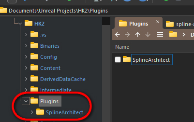
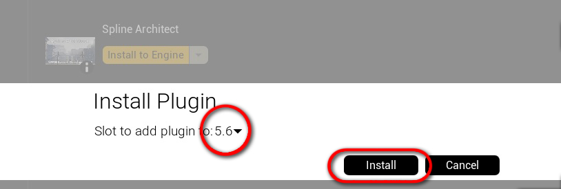
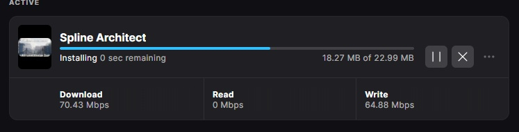
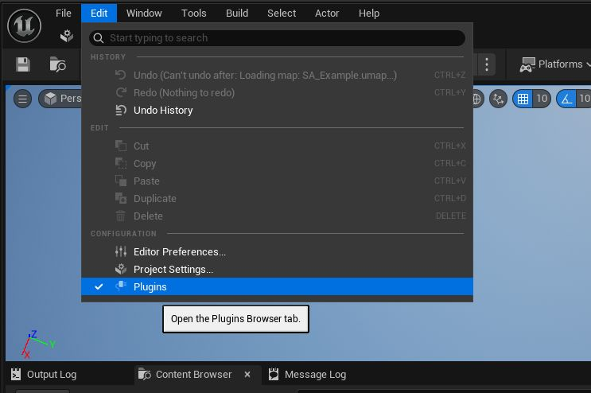

# Installation

This page will help you activate and configure the Spline Architect plugin for your project.

--- 

## 1. Download the plugin

If you received a free trial version by email, copy the plugin files to the "/YourProject/Plugins/" folder

If you purchased [Spline Architect from the FAB store](https://www.fab.com/listings/356b1d13-5080-4418-893d-5a39546bc276), you need to download the plugin via Epic Games Launcher and enable it in your project.

- Find Spline Architect in the "FAB Library" section and click "Install to Engine."

- Select your UE version and install the plugin.

 

---

## 2. Activate the plugin

Open your UE project and click Edit>Plugins, find Spline Architect and check the box (don't forget to reload Unreal Engine)

---

## 2. Launch the Spline Architect widget

- Click Window>Open Spline Architect Widget

{ width="400" }

- The menu that opens, you can pin it to your editor like any other menu

<iframe width="480" height="480" src="https://www.youtube.com/embed/3aaD7yW6nKk" title="" frameBorder="0"   allow="accelerometer; autoplay; clipboard-write; encrypted-media; gyroscope; picture-in-picture; web-share"  allowFullScreen></iframe>
