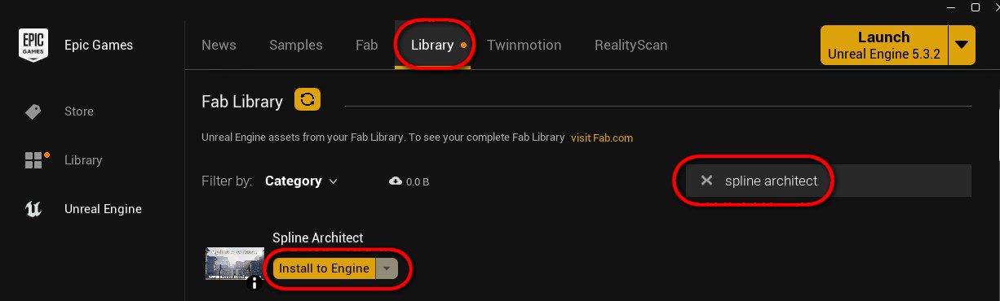
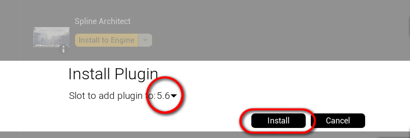
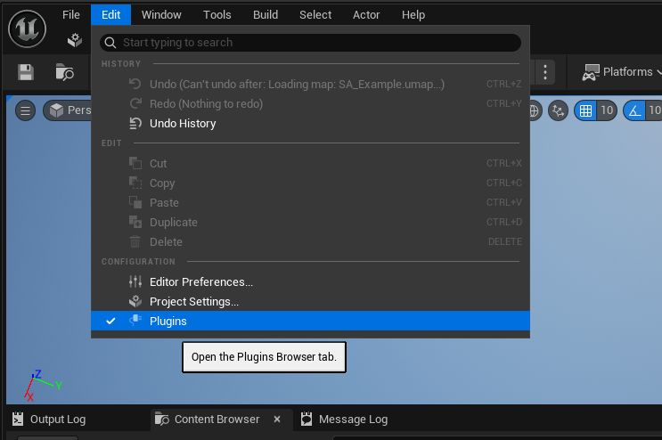
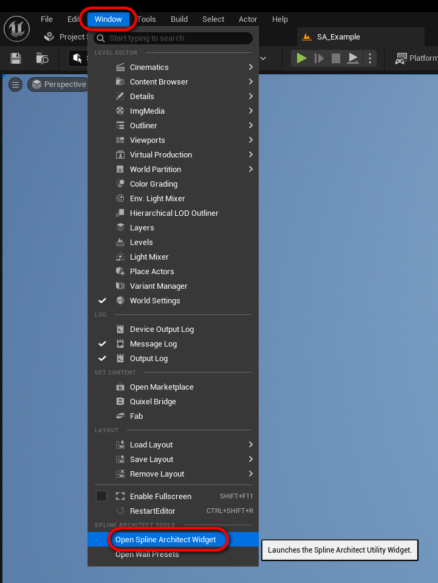

# Installation

This page will guide you through activating and configuring the Spline Architect plugin for your project.

---

## 1. Download the Plugin

If you received a free trial version by email, copy the plugin files into your project’s `/YourProject/Plugins/` folder.

If you purchased Spline Architect from the [FAB Marketplace](https://www.fab.com/listings/356b1d13-5080-4418-893d-5a39546bc276), download the plugin via the Epic Games Launcher and enable it in your project:

- Locate Spline Architect in the FAB Library section and click **Install to Engine**

- Select your Unreal Engine version and install the plugin

 

---

## 2. Enable the Plugin

Open your Unreal Engine project, go to **Edit > Plugins**, find **Spline Architect**, check the box to enable it, and restart the editor.

---

## 3. Launch the Spline Architect Widget

- Open **Window > Open Spline Architect Widget**

{ width="400" }

- Pin the widget to your editor layout like any other panel for convenient access.

<iframe width="480" height="480" src="https://www.youtube.com/embed/3aaD7yW6nKk" title="" frameBorder="0" allow="accelerometer; autoplay; clipboard-write; encrypted-media; gyroscope; picture-in-picture; web-share" allowFullScreen></iframe>

