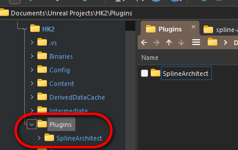
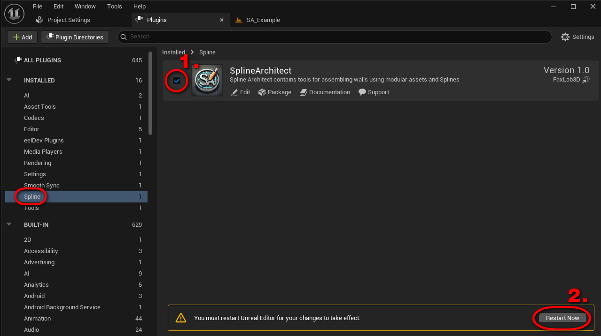

# Instaliacija

Šis puslapis padės aktyvuoti ir susikonfigūruoti Spline Architect plugin'ą jūsų projektui

--- 

## 1. Atsisiųskite plugin'ą

Jeigu gavote nemokamą bandomąją versiją paštu, nukopijuokite plugino failus į "/JusuProjektas/Plugins/" folderį

Jeigu pirkote [Spline Architect FAB parduotuvėje](https://www.fab.com/listings/356b1d13-5080-4418-893d-5a39546bc276), jums reikia atsisiųsti plugin'ą per Epic Games Launcher ir įjungti jį savo projekte.

- Raskite Spline Architect "FAB Library" skilyje ir spustelkite "Install to Engine"

- Pasirinkite savo UE versiją ir instaliuokite plugin'ą

 

---

## 2. Aktyvuokite plugin'ą

Atidarykite savo UE projektą ir spauskite Edit>Plugins, raskite Spline Architect ir pažymėkite varnelę (nepamirškite perkrauti Unreal Engine)

---

## 2. Paleiskite Spline Architect widget'ą

- Spauskite Window>Open Spline Architect Widget

{ width="400" }

- Atsidariusį meniu galite prisegti prie savo editor'iaus kaip bet kurį kitą meniu

<iframe width="480" height="480" src="https://www.youtube.com/embed/3aaD7yW6nKk" title="" frameBorder="0"   allow="accelerometer; autoplay; clipboard-write; encrypted-media; gyroscope; picture-in-picture; web-share"  allowFullScreen></iframe>

 

