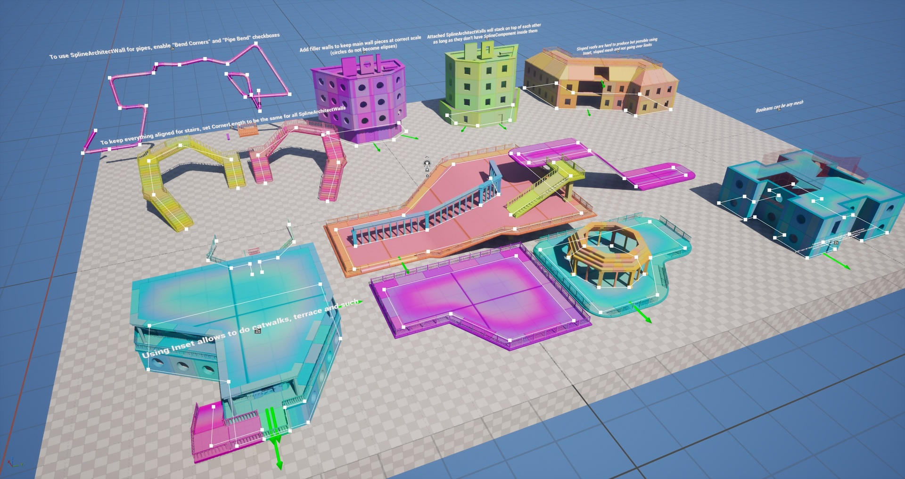
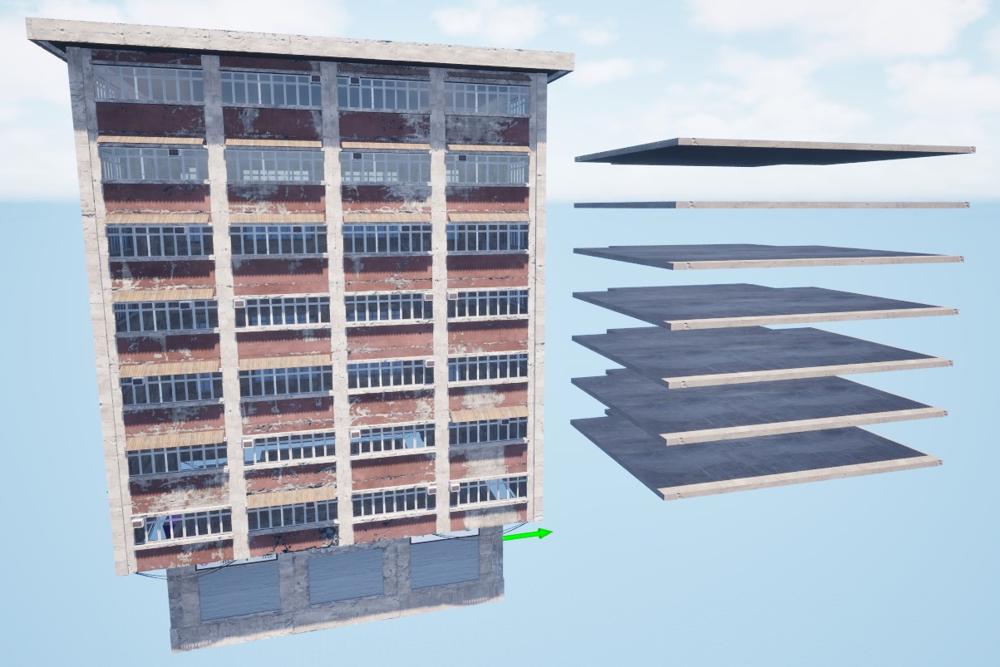
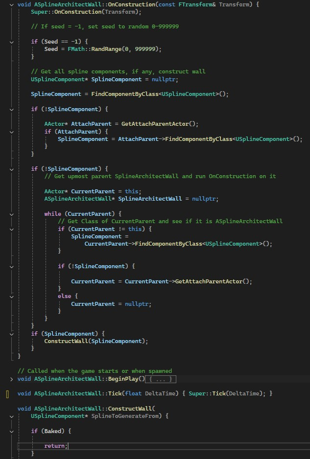
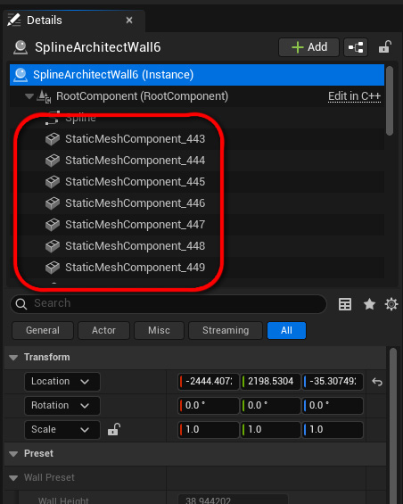
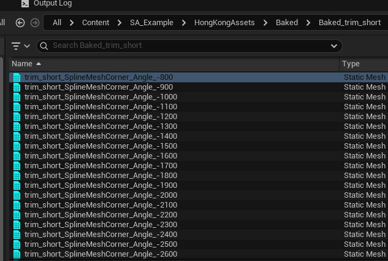
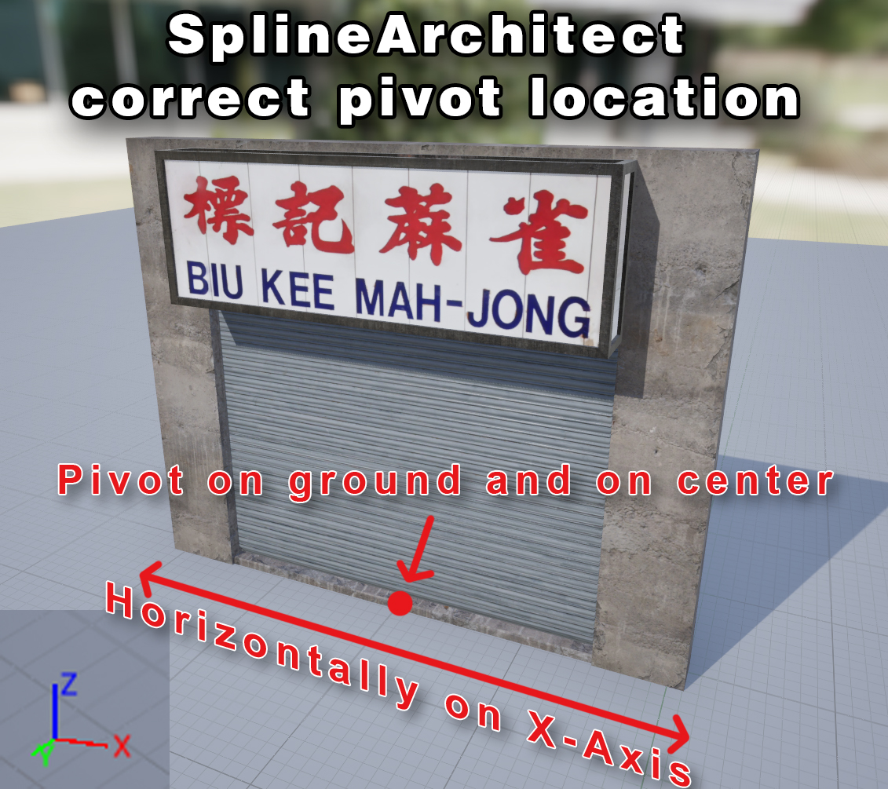
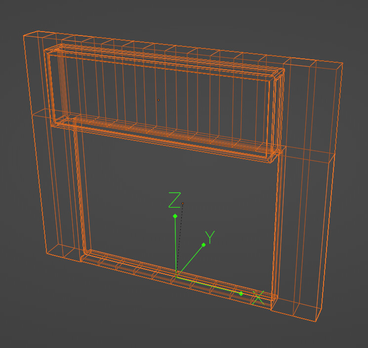
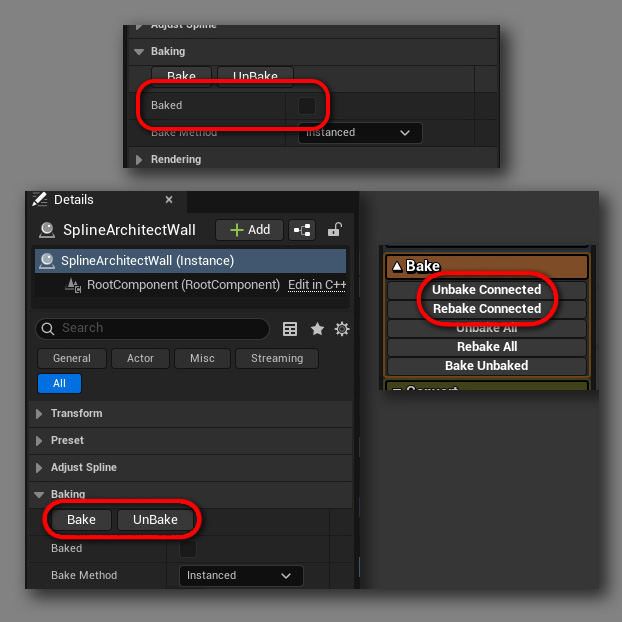

# How does it work?

---

## Operating principle

| Description | Example |
|-------------|---------|
| Spline Architect allows you to create walls and buildings by placing modular meshes along a spline. Corner meshes are generated dynamically, and they can be straight or curved. |  { width="200px" } |
| Floor meshes are also generated dynamically and uniquely for each `SplineArchitectWall`. | { width="200px" } |
| Generation happens inside the `SplineArchitectWall` actor, in the `OnConstruct()` function. The generation runs every time it is loaded, unless the structure has been baked. | { width="200px" } |
| Once `SplineArchitectWall` is baked, all the “one-time” meshes are converted into regular `StaticMesh` components, and the actor no longer executes any logic when loading. | { width="200px" } |
| Baked components can still be modified, and changes will remain until the `SplineArchitectWall` is baked again. | { width="200px" } |
| During baking, `StaticMesh` assets are also created for corners and floors. The meshes are saved with clean names and, where possible, reused in other structures. | { width="200px" } |

---

## Important nuances

| Description | Example |
|-------------|---------|
| Spline Architect expects your modular meshes to be set up like this: - Their length aligned along the X axis - Pivot point centered on X and Y axes, and placed at the floor on the Z axis. |  |
| All `SplineArchitectWall` actors must be baked before packaging the game, otherwise meshes will not exist in the game.   [More about baking](../../2.Overview/Concepts/baking/) | { width="200px" } |
