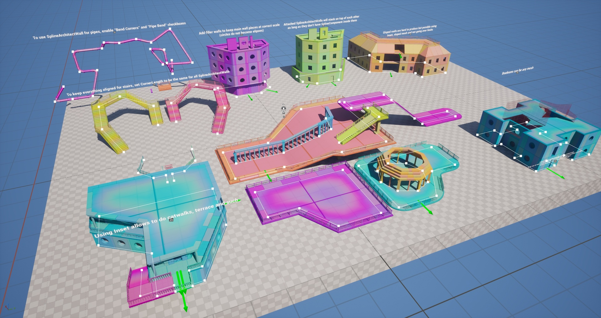
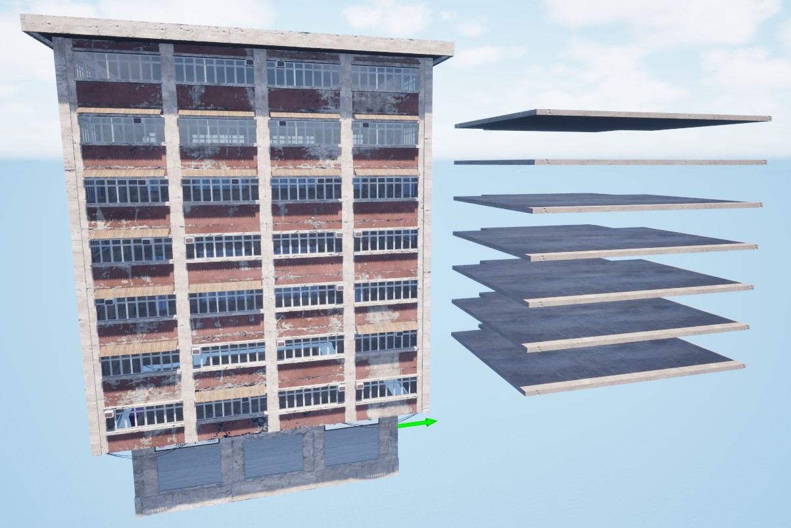
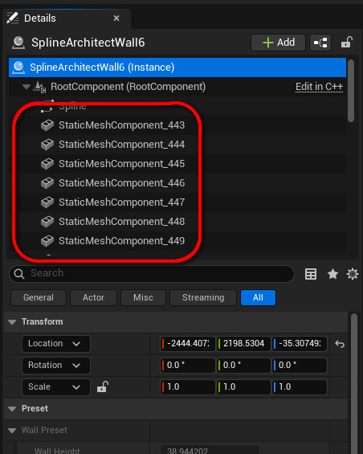
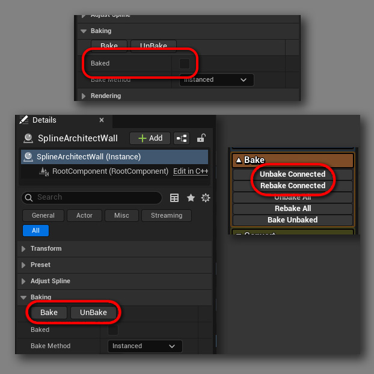

# Kaip veikia?

---

## Veikimo principas

| Aprašymas | Pavyzdys |
|-----------|----------|
| Spline Architect leidžia kurti sienas ir pastatus išdėliojant modulinius meshus pagal spline'ą. Mesh'ai ant kampų yra sugeneruojami dinamiškai, jie gali būtų statūs ar lenkti. |  { width="200px" } |
| Grindų mesh'ai taippat yra sugeneruojami dinamiškai kiekvienam `SplineArchitectWall` unikaliai. | { width="200px" } |
| Generacija vyksta `SplineArchitectWall` aktoriuje, `OnConstruct()` funkcijoje. Generacija vyks kiekvieną kartą jį užkrovus, nebent struktūra bus išbake'inta. | { width="200px" } |
| Išbake'inus `SplineArchitectWall`, visi „vienkartiniai“ meshai yra paverčiami į paprastus `StaticMesh` komponentus ir aktorius daugiau nebevykdo jokios logikos jį kraunant. | { width="200px" } |
| Išbake'inti komponentai gali būti modifikuojami, pakeitimai laikysis iki kol `SplineArchitectWall` bus išbake'inamas iš naujo. | { width="200px" } |
| Bake'inimo metu taip pat yra sukūriami `StaticMesh` asset'ai kampams ir grindims. Mesh'ai yra užsaugomi su tvarkingais pavadinimais ir, esant galimybei, yra pernaudojami kitose struktūrose. | { width="200px" } |

---

## Svarbūs niuansai

| Aprašymas | Pavyzdys |
|-----------|----------|
| Spline Architect tikisi, kad jūsų moduliniai mesh'ai bus sukonfigūruoti taip: - Jų ilgis būtų ant X ašies - Pivot point'as X ir Y ašimis per vidurį ir Z ašimi ant grindų. |  |
| Visi `SplineArchitectWall` aktoriai turi būti išbake'inti prieš package'inant žaidimą, kitaip žaidime mesh'ai neegzistuos.   [Daugiau apie bake'inimą ](../../2.Overview/Concepts/baking/)| { width="200px" } |
