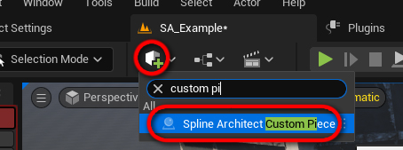
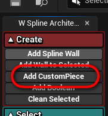
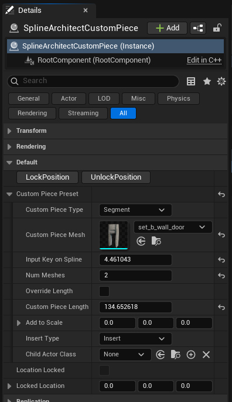

# SplineArchitectCustomPiece

## 1. Kas yra `SplineArchitectCustomPiece`?

`SplineArchitectCustomPiece` yra aktorius, kuris yra priattach'inamas prie `SplineArchitectWall` aktoriaus ir leidžia įterpti bet kokį mesh'ą tarp sienų

## 2. Kaip sukurti `SplineArchitectCustomPiece`?

`SplineArchitectCustomPiece` aktorius gali būti sukurtas dviem būdais:

- Pirmas būdas yra rasti aktorių kūrimo meniu ir nutempti jį į level'į. Tada reikia priattach'inti jį prie `SplineArchitectWall` aktoriaus, ir jis bus prisnap'inamas prie savo parent `SplineArchitectWall` aktoriaus

- Antras būdas yra tiesiog paspausti "Add Custom Piece" mygtuką Spline Architect pagalbiniame widget'e. Šis mygtukas padarys tą patį, kaip ir instrukcijos viršuje. Naujas `SplineArchitectCustomPiece` bus paspawn'intas levelyje viewport'o centre ir priattach'intas prie pažymėto `SplineArchitectWall` aktoriaus

## 3. `SplineArchitectCustomPiece` parametrai

{ width="250px" }

- __Lock Position__ Ši funkcija užrakins Custom Piece ir jos pozicija liks vietoje, net jei `SplineArchitectWall` bus perkeltas ar pakeistas. Tai naudinga, kai, sakykime durys turi būti visada vienoje vietoje level'yje
- __Unlock Position__ Ši funkcija atrakins Custom Piece poziciją, ir jis vėl judės kartu su savo `SplineArchitectWall` parent'u
- __Custom Piece Type__ Custom Piece gali būti Segment arba Corner tipo. Segment tipo Custom Piece bus įterptas į sieną, pavyzdžiui durys ar langas. Corner tipo Custom Piece gali pakeisti specifinio kampo parametrus, pavyzdžiui jeigu reikia vieną sienos kampą padarytį užapvalintą
- __Custom Piece Mesh__ Tai yra mesh'as, kuris bus naudojamas kaip Custom Piece
- __Input Key on Spline__ Šis parametras nurodo, kurioje vietoje Spline'e bus įterptas Custom Piece. Jeigu Custom Piece yra judinamas ranka, šis parametras bus rastas pagal Custom Piece poziciją. Taippat galima nurodytį specifinį Spline Key, jeigu, sakykime norime įterpti Custom Piece tobulai per centrą tarp dviejų Spline Point'ų
- __Num Meshes__ Tai yra kiek kartų bus įterptas Custom Piece. Naudinga, jeigu norite, kad Custom Piece būtų kartojamas n kartų segmente. Galima įrašyti labai didelį skaičių, kad butų užpildytas visas segmentas.
- __Override Length__ Jeigu Override Length yra `true`, galima koreguoti Custom Piece Length, jeigu ne, Custom Piece Length bus apskaičiuotas automatiškai pagal Custom Piece Mesh (ilgis X ašimi)
- __Custom Piece Length__ Tai yra Custom Piece ilgis, arba automatinis arba rankinis, priklausomai nuo Override Length parametro
- __Add to Scale__ Tai yra vektorius, kuris bus pridedamas prie Custom Piece scale'o. Naudinga, jeigu norite padidinti ar sumažinti Custom Piece dydį rankiniu būdu
- __Insert Type__ Tai yra tipas, kaip bus įterptas Custom Piece. Gali būti `Insert`, arba `Overlap`. Kai `Insert`, segmentas bus iškirptas ir ten bus įklijuota Custom Piece, jeigu `Overlap`, Custom Piece bus tiesiog uždėtas ant esančio segmento
- __Child Actor Class__ Tai yra klasė, kuri bus naudojama kaip Child Actor. Naudinga, jeigu norite pridėti papildomų funkcijų prie Custom Piece, pavyzdžiui, dinamiškai atsidarinėjančias duris.
- __Location Locked__ Tai yra parametras, kuris rodo, ar Custom Piece pozicija yra užrakinta ar ne. 
- __Locked Location__ Tai yra Custom Piece pozicija, kuri bus naudojama, kai Location Locked yra `true`. Naudojant Lock Position funkciją, jis bus nustatytas į esamą Custom Piece poziciją. Galima modifikuoti rankiniu būdu, jeigu reikia.