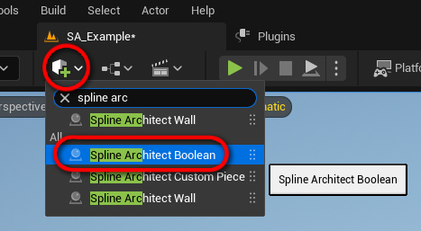
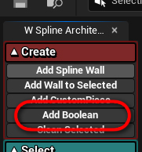
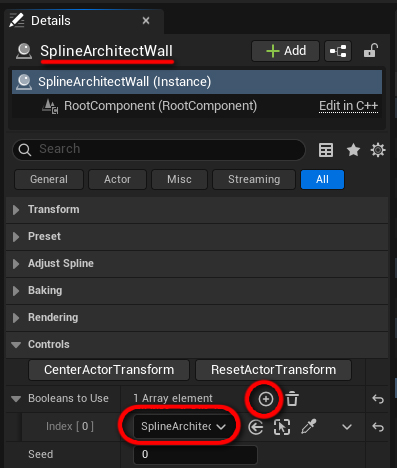
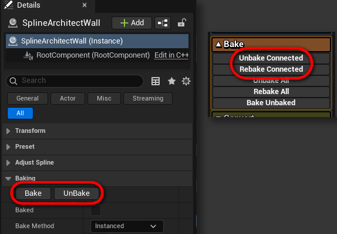

# SplineArchitectBoolean

## 1. Kas yra `SplineArchitectBoolean`?

`SplineArchitectBoolean` yra aktorius, kuris leidžia atlikti boolean operacijas su `SplineArchitectWall` grindų ar lubų meshuose. Tai leidžia iškirpti skyles laiptams ar panašiai. Boolean'o forma gali būti bet koks StaticMesh asset'as

---

## 2. Kaip sukurti `SplineArchitectBoolean`?

`SplineArchitectBoolean` aktorius gali būti sukurtas dviem būdais:

- Pirmas būdas yra rasti aktorių kūrimo meniu ir nutempti jį į level'į.

{ align=right }

- Antras būdas yra tiesiog paspausti "Add Boolean" mygtuką Spline Architect pagalbiniame widget'e. Šis mygtukas padarys tą patį, kaip ir instrukcijos viršuje. Naujas `SplineArchitectBoolean` bus paspawn'intas levelyje viewport'o centre. Jeigu jis liesis prie `SplineArchitectWall`, bus aušomatiškai įdėtas į "Booleans to Use" array'ų tame `SplineArchitectWall` aktoriuje.

---

## 2. Kaip naudoti `SplineArchitectBoolean`?

| Tekstas | Vaizdas |
|---|---|
| `SplineArchitectBoolean` aktorius gali būti naudojamas vieno ar kelių `SplineArchitectWall` aktorių. Jeigu norime iškirpti skylę kokiame nors `SplineArchitectWall`, turime pridėti `SplineArchitectBoolean` į "Booleans to Use" array'ų `SplineArchitectWall` aktoriuje. | { width="150px" } |
| Boolean'ai gali būt bet kokios formos, ji bus nukopijuota iš `StaticMesh` asset'o. | { width="150px" } |
| Pakeitus `SplineArchitectBoolean` mesh'ą ar poziciją, `SplineArchitectWall` aktoriai nebus automatiškai atnaujinti ir jie turės būt iš naujo sugeneruoti. Tą lengvai galima padaryti paselect'inus `SplineArchitectWall` aktorių ir paspaudus **"UnBake"** ar **"Bake"** pačiame aktoriuje, arba **"Unbake Connected"** ar **"Rebake Connected"** pagalbiniame widget'e. | { width="150px" } |
