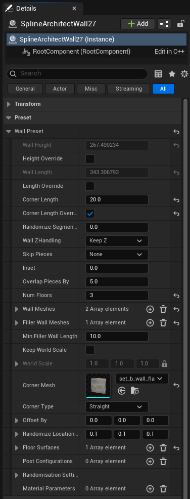

```markdown
# Wall Preset

## 1. What is a Wall Preset?

A Wall Preset is a `Struct` that defines how a generated `SplineArchitectWall` actor will look. It is located in the Preset category of the `SplineArchitectWall` actor (Details panel).

{ width="300px" }

---

## 2. What do the Wall Preset parameters do?


| Parameter                | Example |
|--------------------------|----------|
| **WallHeight**<br>– Sets the wall height; the scale is applied to all meshes based on this value. | { .off-glb } |
| **HeightOverride**<br>– If `true`, allows manually setting the wall height; otherwise, `WallHeight` is taken from the first element of the `WallMeshes` array. | |
| **WallLength**<br>– Sets the length of a wall segment; segments will be divided by this value, and meshes from the `WallMeshes` array will be selected based on the segment length. | { .off-glb } |
| **LengthOverride**<br>– If `true`, allows manually setting the wall length; otherwise, `WallLength` is taken from the first element of the `WallMeshes` array. | |
| **CornerLength**<br>– Sets the corner length; this much is subtracted from segments to form a corner. | { .off-glb } |
| **CornerLengthOverride**<br>– If `true`, allows manually changing the corner length; otherwise, `CornerLength` is taken from the `CornerMesh`. | |
| **RandomizeSegmentsBy**<br>– Randomizes the length of the segments. Can be used to add variety to the wall, as a different mesh can be selected based on the segment length, which adds variation. | { .off-glb } |
| **WallZHandling**<br>– Specifies how to arrange meshes when Spline segments are not flat (`KeepZ` will maintain "Pitch" rotation at 0 and only change the mesh's Z position, `FollowSpline` will rotate the mesh according to the segment's "Pitch", and `Skew` will generate a new, bent mesh). | { .off-glb }<br>{ .off-glb }  |
| **SkipPieces**<br>– Allows skipping or keeping certain segments (either straight or tilted). | { .off-glb } |
| **Inset**<br>– Pushes meshes inwards or outwards from the spline by a specified distance. | { .off-glb } |
| **OverlapPiecesBy**<br>– The amount of overlap to prevent gaps between meshes due to imperfect edges. |{ .off-glb }|
| **NumFloors**<br>– How many times to duplicate segments with a Z offset equal to `WallHeight` (number of floors). | { .off-glb } |
| **WallMeshes**<br>– The main meshes for wall segments; the most suitable one is selected from this array based on segment length. | { .off-glb } |
| **FillerWallMeshes**<br>– Additional meshes to fill gaps, preventing the main `WallMeshes` from stretching or shrinking. |{ .off-glb }<br>{ .off-glb } |
| **MinFillerWallLength**<br>– The minimum length for a filler mesh; shorter meshes will not be placed. | |
| **KeepWorldScale**<br>– If `true`, meshes will not be scaled according to the segment, but will use their original scale. |{ .off-glb } |
| **WorldScale**<br>– The original scale of the meshes, applied when `KeepWorldScale` is `true`. | |
| **CornerMesh**<br>– The mesh used for forming corners. |{ .off-glb } |
| **CornerType**<br>– The type of corner: `Straight`, `Bend`, `Chamfer`, or `Pipe`. (`Pipe` will be used for pipes with a centered pivot). |{ .off-glb } |
| **OffsetBy**<br>– Offsets all meshes by the specified vector. |{ .off-glb } |
| **RandomizeLocationBy**<br>– Randomly changes the position of meshes by this vector (small values are recommended to avoid Z-fighting). |{ .off-glb } |
| **FloorSurfaces**<br>– An array of floor configurations, where each element describes the parameters of the floor surface. |{ .off-glb }<br>{ .off-glb } |
| **PostConfigurations**<br>– An array of post configurations, determining how and where posts will be generated. | |
| **RandomisationSettings**<br>– Randomization settings that allow for random changes to the layout and transformations of meshes. | |
| **MaterialParameters**<br>– An array of material parameters that allows setting specific material parameters on certain meshes. | |

### FloorSurfaces parameters (FFloorData):

| Parameter                | Example |
|--------------------------|-------------|
| **Material**<br>– The material that will be applied to the floor surface. | |
| **AlignTo**<br>– Floor alignment relative to the main walls: `Top`, `Center`, or `Bottom`. | |
| **ZOffset**<br>– Vertical offset for the floor position. | |
| **Inset**<br>– Insetting the floor inwards or outwards from the wall contour. | |
| **Thickness**<br>– The thickness of the floor (extrude height). | |
| **Subdivisions**<br>– Controls the number of polygons in the floor. | |
| **BendsResolution**<br>– Sets the distance between vertices on curved corners. | |
| **UVScale**<br>– Changes the scale of the floor's UV coordinates. | |
| **FillColor**<br>– Vertex color applied to all vertices except the edges. | |
| **EdgesColor**<br>– Vertex color for the edges. | |
| **ColorBlurIterations**<br>– More iterations will blur the floor mesh's vertex colors more. | |
| **UseDelaunayTriangulation**<br>– Delaunay triangulation provides better triangulation, but edges cannot overlap. If the floor mesh isn't working, try disabling this parameter. | |

### PostConfigurations parameters (FPostData):

| Parameter                | Example |
|--------------------------|-------------|
| **PostMesh**<br>– The mesh used for generating posts. | |
| **GenerationMethod**<br>– Post generation method: `OnCorners`, `OnSplinePoints`, `BetweenSegments`, `OnCustomPieces`, `Periodically`, `StartAndEnd`. | |
| **AverageDirections**<br>– Only applicable when `GenerationMethod` is `OnSplinePoints`. Averages the directions. | |
| **PeriodDistance**<br>– Only applicable when `GenerationMethod` is `Periodically`. Sets the distance between posts. | |
| **PostOffset**<br>– Offsets the posts by a specified vector (X - along the spline, Y - inwards/outwards, Z - vertically). | |
| **AddRotation**<br>– Adds rotation to all posts. | |
| **bScaleToWallHeight**<br>– Automatically changes the post's scale to match `WallHeight`. | |
| **PostScale**<br>– Adjusts the post's scale. | |
| **SkipRule**<br>– Can skip posts if the segment is flat or tilted. | |

### RandomisationSettings parameters (FRandomSettings):

| Parameter                | Example |
|--------------------------|-------------|
| **RandomMeshes**<br>– An array of `FRandomMeshes` structs that define the rules for random mesh swapping. | |

#### FRandomMeshes parameters:

| Parameter                | Example |
|--------------------------|-------------|
| **KeyMesh**<br>– The target mesh to be replaced by a random one from the `RandomMeshes` array (including `KeyMesh` itself). | |
| **RandomMeshes**<br>– An array of meshes with weights (`FRandomMeshWithWeight`) from which one is randomly selected. A higher weight increases the chance for that mesh. | |
| **FitRandomType**<br>– `MatchScale` or `KeepScale` - determines whether to maintain the original scale or to scale the mesh to fit into the key mesh. | |
| **Knockout**<br>– Controls how many meshes will be randomly removed (0.0f = none, 1.0f = all). | |
| **MirrorX/Y/Z**<br>– Option to multiply the scale by -1. Only works when converting to `StaticMeshComponents`. | |
| **Rot90**<br>– Randomly rotates meshes by 90, 180, or 270 degrees. | |
| **Rot180**<br>– Randomly rotates meshes by 180 degrees only. | |

### MaterialParameters parameters (FMatParams):

| Parameter                | Example |
|--------------------------|-------------|
| **MaterialApplicationMode**<br>– Material application mode: `Include` (only specified), `Exclude` (except specified), `All` (for all). | |
| **MaterialReferences**<br>– A list of materials to apply parameters to (when the mode is not `All`). | |
| **MeshApplicationMode**<br>– Mesh selection mode: `Include`, `Exclude`, or `All`. We can change Material parameters only on specific meshes if needed. | |
| **StaticMeshReferences**<br>– A list of meshes to apply parameters to (when the mode is not `All`). We can change Material parameters only on specific meshes if needed. | |
| **Parameters**<br>– An array of material parameters (`FMatParam`). | |

#### FMatParam parameters:

| Parameter                | Example |
|--------------------------|-------------|
| **ParameterName**<br>– The name of the material parameter we want to change. | |
| **ParameterType**<br>– The parameter type: `Float` or `Vector`. | |
| **FloatValue**<br>– The float value (when the type is `Float`). | |
| **ColorValue**<br>– The color value (when the type is `Vector`). | |
```