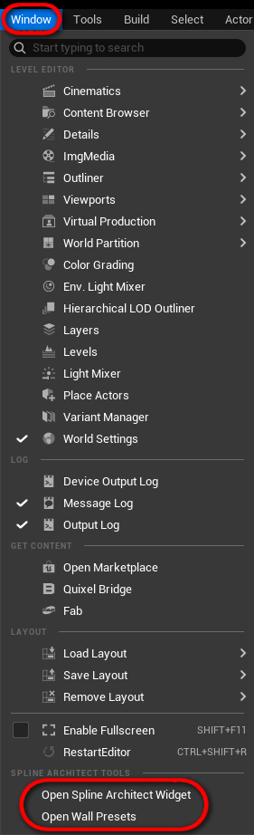
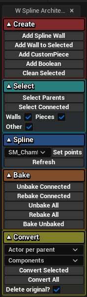

# Widgets

Spline Architect includes two widgets designed to simplify and speed up working with the plugin.

- **W_SplineArchitectUtilityWidget** provides quick functions to add new actors like `SplineArchitectWall`, `SplineArchitectBoolean`, or `SplineArchitectCustomPiece`. It also offers tools to quickly select or bake all/selected/connected `SplineArchitectWall` actors, as well as convert them to regular actors. There are also utilities for working with Splines.
- **W_WallPresets widget** is meant for quickly creating new `SplineArchitectWall` presets. These can be presets for individual `SplineArchitectWall` actors or complex presets consisting of multiple walls and `CustomPiece` elements — such as entire buildings.

Widgets can be accessed via **Window > Open Spline Architect Widget/Wall Presets**

{ width="150px" }

## Utility Widget

{ width="150px" }

### Create

| **Button**              | **Explanation** |
|-------------------------|------------------|
| Add Spline Wall         |Creates a new `SplineArchitectWall` in the Level and adds a `SplineComponent` to it.|
| Add Wall to Selected    |Creates a new `SplineArchitectWall` in the Level and automatically attaches it to the currently selected `SplineArchitectWall` (also copies the `WallPreset` from the selected one).|
| Add CustomPiece         |Spawns a `CustomPiece` at the center of the screen and attaches it to the selected `SplineArchitectWall`.|
| Add Boolean             |Spawns a `SplineArchitectBoolean` at the screen center. If a `SplineArchitectWall` is selected, the Boolean is automatically added to its “Booleans to Use” array.|
| Clean Selected          |Keeps only the main `SplineArchitectWall` and deletes all attached actors. Also resets the `WallPreset` to default.|

---

### Select

| **Button**         | **Explanation** |
|--------------------|------------------|
| Select Parents     |Selects only parent `SplineArchitectWall` actors with a `SplineComponent` from the current selection.|
| Select Connected   |Selects all attached `SplineArchitectWall`, `CustomPiece`, and other connected actors — both parent and child.|
| Walls ☑️ Pieces ☑️ Other ☑️ |Toggle inclusion of `SplineArchitectWall`, `SplineArchitectCustomPiece`, or other actors.|

---

### Spline

| **Button**            | **Explanation** |
|------------------------|------------------|
| StaticMesh dropdown 🔽 |Select a `StaticMesh` (flat mesh with open edges) to use as a template.|
| Set points             |Reads border edges from the selected mesh (located in `Plugins/SplineArchitect/Meshes/BasicShapes`) and generates spline points based on them for selected `SplineArchitectWall` actors.|
| Refresh                |Scans the `Plugins/SplineArchitect/Meshes/BasicShapes` folder and refreshes the dropdown options.|

---

### Bake

[More on baking](../../Concepts/baking)

| **Button**          | **Explanation** |
|----------------------|------------------|
| Unbake Connected     |Unbakes all selected `SplineArchitectWall` actors (both parents and children).|
| ReBake Connected     |Rebakes all selected `SplineArchitectWall` actors (both parents and children).|
| Unbake All           |Unbakes all `SplineArchitectWall` actors in the Level.|
| ReBake All           |Bakes all `SplineArchitectWall` actors in the Level.|
| Bake Unbaked         |Only bakes `SplineArchitectWall` actors that haven't been baked yet.|

---

### Convert

[More on converting](../../Concepts/converting)

| **Button**               | **Explanation** |
|---------------------------|------------------|
| Actor per parent 🔽       |- **Actor per wall** – creates one actor for each `SplineArchitectWall`, with instanced `StaticMesh` components. - **Actor per parent** – creates one actor per `SplineArchitectWall`, maintaining parent-child hierarchy. - **Actor per mesh** – creates a separate `StaticMeshActor` for each mesh, useful for manual editing.|
| Components 🔽             |- **Instanced** – creates only `HierarchicalInstancedStaticMesh` components. Fewer draw calls, less editable. - **Components** – creates a `StaticMeshComponent` for each mesh, easier to edit but uses more draw calls.|
| Convert Selected          |Converts selected `SplineArchitectWall` actors into regular actors with components. Useful when the project doesn’t have the `SplineArchitect` plugin.|
| Convert All               |Converts all `SplineArchitectWall` actors in the Level into regular actors.|
| Delete original? ☑️       |Deletes original `SplineArchitect` actors and keeps only the converted ones.|

---

## Presets Widget

### Walls

- Wall-only presets. Allows quick copy/paste of individual `SplineArchitectWall` presets from selected actors.

| Button      | Description |
|-------------|-------------|
| **Copy**    |Copies the `WallPreset` struct from the selected `SplineArchitectWall` and saves it as a SaveGame file `SplineArchitectWallPresets.sav` in the "YourProject\Saved\SaveGames" folder.|

### Buildings

- Presets composed of multiple `SplineArchitectWall` and `CustomPiece` actors. Allows quick duplication of entire building structures.

| Button           | Description |
|------------------|-------------|
| **Copy**         |Copies the `SplineArchitectWall` hierarchy (and optionally `CustomPiece`s) into a preset. Can be pasted onto another `SplineArchitectWall` with a spline — recreating the full stack.|
| **Paste**        |Pastes a previously copied hierarchy onto a selected `SplineArchitectWall`. If it lacks a `SplineComponent`, it searches for a parent actor with a spline.|
| **Copy Pieces?** |Whether to also copy `CustomPiece` actors attached to the selected building.|
| **PresetName**   |Name of the preset.|
| **Save Preset**  |Saves the preset as a SaveGame file `SplineArchitectSaveGame.sav`, located in "YourProject\Saved\SaveGames".|
| **Filter**       |Filters presets by input text.|
| **Clear Presets**|Deletes all presets!|
