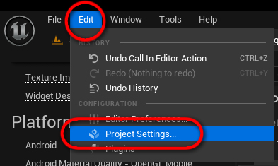

# Project Settings

Spline Architect has several settings available in the Project Settings menu.

Spline Architect settings can be accessed via Edit -> Project Settings -> Spline Architect (under the Plugins category).

 

## Corner Angle Increment
Controls the angle increment at which new meshes for corners will be baked. To avoid generating too many baked meshes, all corner angles will be rounded according to this value. For example, if the Corner Angle Increment is 0.5, corners will be baked every 0.5 degrees (0.5, 1, 1.5, etc.), and if it’s 1, then every full degree (0, 1, 2, etc.).

## Default Wall Preset
This sets the default `SplineArchitectWall` preset that will be used when creating new `SplineArchitectWall` actors.

## On Level Save Action
This setting controls what happens to `SplineArchitectWall` actors when the Level is saved. It is useful for automatically baking all `SplineArchitectWall` actors before packaging the game.

Options available:

- `Nothing` – does nothing, leaves everything as-is
- `Rebake Unbaked` – bakes only those `SplineArchitectWall` actors that haven’t been baked yet
- `Rebake All` – bakes all `SplineArchitectWall` actors
- `Unbake All` – unbakes all `SplineArchitectWall` actors

Note: Actors will also be baked when using the Auto-Save command.
