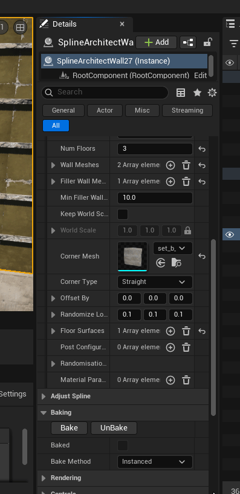
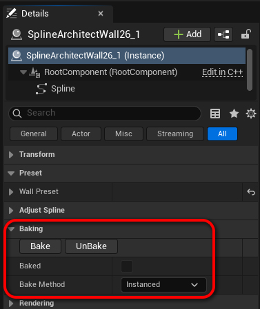
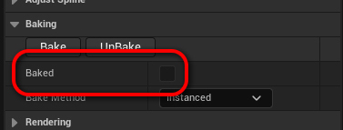
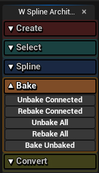

# Bake'inimas

Bake'inimas yra vienas iš esminių dalykų Spline Architect plugin'e. Prieš package'inant žaidimą, visi `SplineArchitectWall` turi būti išbake'inti. Tai reiškia, kad visos sugeneruotos detalės taps StaticMesh ar InstancedStaticMesh komponentais, dinamiškai sugeneruotos detalės bus užsaugotos, kaip StatcMesh asset'ai ir `SplineArchitectWall` nebevykdys jokios logikos pasileidžiant Level'iui (jokio ConstructionScript).

{ align=right }

`SplineArchitectWall` "Details" panel'yje yra mygtukai atsakingi už bake'inimą. Taippat yra pasirinkimas, kaip bus išbake'inti komponentai. `Instanced` arba `Components`

- `Instanced` bake metodu bus sukurti `InstancedStaticMeshComponent` komponentai, kurie bus našesni renderinti, bet bus sunku redaguoti poziciją, rotaciją ar kitus parametrus po bake'inimo.
- `Components` bake metodu bus sukurti `StaticMeshComponent` komponentai, kurie bus lengvai redaguojami, bet reikalauja daugiau draw call'ų.

---

Išbake'inus `SplineArchitectWall` WallPreset'o nebebus galima redaguoti, ir jeigu jis bus 'grayed-out', reiškia šis aktorius yra išbake'intas. Taip pat, bake statusą galima matyti pažiūrėjus į "Baked" bool'ą.

---

{ align=right }

Norint išbake'inti `SplineArchitectWall`, nereikia to daryti kiekvienam `SplineArchitectWall` atskirai. Galima naudotis "Bake" skiltyje esančiais mygtukais Utility Widget'e. Galima išbake'inti ar atbake'inti visus, pasirinktus ar sujungtus `SplineArchitectWall` aktorius.
Daugiau apie šiuos mygtukus galima rasti [čia](../../Components/5.Widgets/#bake)

---

# Automatinis bake'inimas

Spline Architect Project Settings'uose galima nusistatyti, kad sienos būtų automatiškai išbake'inamos tuo metu, kai yra save'inamas Level'is. Daugiau apie tai [Project Settings](../../Components/6.Project-Settings/#on-level-save-action) skiltyje
