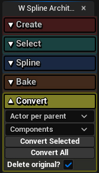

# Conversion

{ align=right }

Conversion is the process where Spline Architect actors are transformed into regular Unreal Engine actors.

This allows using Spline Architect created actors in other projects that do not have the Spline Architect plugin. For example, sharing your created project with others who don’t have the plugin, or uploading created assets to FAB Marketplace or similar.

## How to convert Spline Architect actors?

Conversion is very simple: just select the Spline Architect actors you want to convert and use the "Convert" functions in the Utility Widget.

Converted actors will be placed into a "Converted" folder in the Outliner. Originals, if not deleted, will be placed in an "Original" folder.

| **Button**             | **Explanation**                                                                                     |
|------------------------|---------------------------------------------------------------------------------------------------|
| `Actor per parent`      | Creates a separate actor for each parent `SplineArchitectWall`, including all of its attached child components. |
| `Actor per wall`        | Creates a separate actor for each `SplineArchitectWall` with all its components – maintains parent/child hierarchy. |
| `Actor per mesh`        | Creates separate `StaticMeshActor` for each used mesh – useful for manual editing later.          |
| `Instanced`             | Creates only `HierarchicalInstancedStaticMesh` components – better performance, harder to edit.   |
| `Components`            | Creates `StaticMeshComponent` components – easier to edit but requires more draw calls.           |
| **Convert Selected**    | Converts only the selected `SplineArchitectWall` actors (and all attached child actors).          |
| **Convert All**         | Converts all `SplineArchitectWall` actors in the Level.                                           |
| `Delete original?`      | Deletes the original `SplineArchitectWall` actors, leaving only the converted ones.                |
