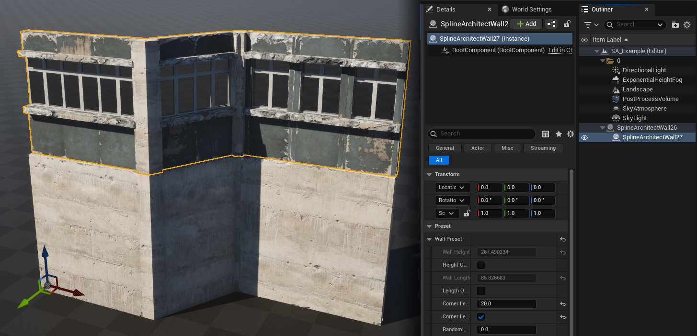
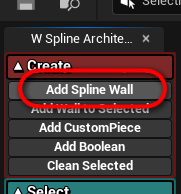
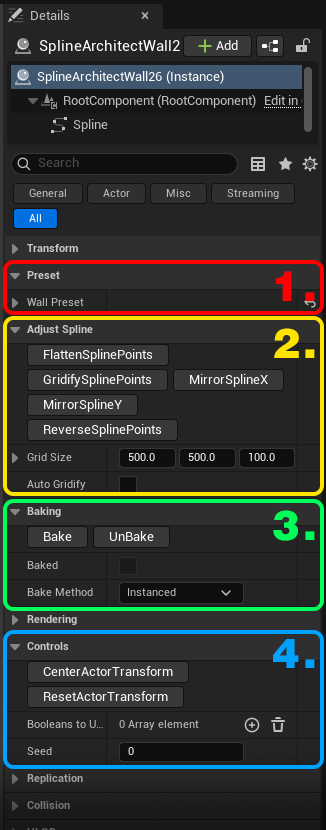
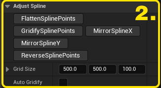

# SplineArchitectWall

## 1. What is `SplineArchitectWall`?
`SplineArchitectWall` is the main class, or actor, where details made from modular meshes will be generated.
For `SplineArchitectWall` to generate meshes, it must have a `SplineComponent` component.

When attaching one `SplineArchitectWall` to another, the attached actor will be positioned on its parent and generate meshes on top, like a second floor or similar.

---

## 2. How to create a `SplineArchitectWall`?
You can create a `SplineArchitectWall` in two ways:

- The first way is to find it in the actor creation menu and drag it into the level.

For the created actor to generate meshes, you need to add a `SplineComponent` component to the actor itself.

---

- The second and easier way is to simply press the "Add Spline Wall" button in the Spline Architect utility widget. This button does the same as the instructions above. A new `SplineArchitectWall` will spawn at the viewport center in the level and have a `SplineComponent` component added.

- You can create a new `SplineArchitectWall` and attach it to the selected `SplineArchitectWall` by pressing "Add Wall to Selected".

---

## 3. `SplineArchitectWall` parameters

{ width="100px" }

### 1. Preset
{ align=right }

The Preset category has a single parameter "Preset," which is a struct specifying exactly how the `SplineArchitectWall` will be generated, which meshes will be used, etc.

### 2. Adjust Spline
{ align=right }

The Adjust Spline category contains functions for working with the `SplineComponent` in this actor:

- __Flatten Spline Points__ sets all spline points' Z positions to the first spline point's Z position, useful if any spline point was accidentally moved on the Z axis.
- __Gridify Spline Points__ rounds spline points' positions according to the Grid Size vector. Useful for buildings, as by default you might want to copy positions from one point to another; otherwise, manual adjustments result in crooked lines.
- __Mirror Spline X and Y__ mirrors (flips) spline points, useful if you want two symmetrical walls—you can copy one and mirror it.
- __Reverse Spline Points__ reverses the order of spline points, useful if a wall is facing the wrong direction.
- __Grid Size__ specifies the rounding precision for spline point positions.
- __Auto Gridify__ – when enabled, spline points' positions are automatically rounded.

### 3. Baking
{ align=right }

The Baking category contains functions and parameters needed to bake or unbake the `SplineArchitectWall` actor.
A baked actor will no longer regenerate meshes, and its WallPreset will be locked and unmodifiable until the "UnBake" function is used.

[More about baking](../../Concepts/baking)
   
- __Bake__ button bakes this wall
- __UnBake__ button unbakes this wall
- __Baked__ boolean cannot be modified; it just shows if this actor is baked or not
- __Bake Method__ specifies how the actor will be baked: either "Instanced" or "Components". "Instanced" uses `InstancedStaticMeshComponent` for better rendering performance but harder editing; "Components" uses `StaticMeshComponent`, easier to edit transforms after baking.

### 4. Controls
{ align=right }

The Controls category contains several functions and parameters to manage this specific `SplineArchitectWall` actor:

- __CenterActorTransform__ button centers the actor to the average position of the main `SplineComponent` spline points.
- __ResetActorTransform__ button resets the actor’s scale to (1,1,1) and position to the first spline point’s position.
- __BooleansToUse__ array specifying which `SplineArchitectBoolean` actors this `SplineArchitectWall` uses to cut holes in floor or ceiling meshes.
- __Seed__ specifies the random seed used by this actor when randomization parameters are applied, to avoid similar randomization results among actors.

