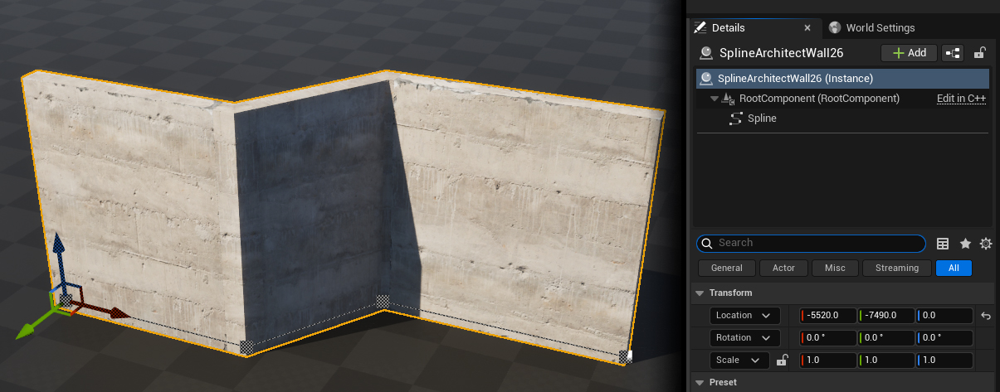
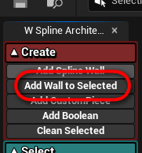
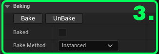
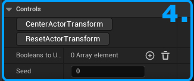

# SplineArchitectWall

## 1. Kas yra `SplineArchitectWall`?
`SplineArchitectWall` yra pagrindinė klasė, arba aktorius, kuriame bus sugeneruotos detalės iš modulinių meshų.
Tam, kad `SplineArchitectWall` generuotu meshus, jis turi turėti `SplineComponent` komponentą.

Priattachinus `SplineArchitectWall` prie kito `SplineArchitectWall`, priattachintas aktorius bus pastatytas ant savo parent'o ir generuos meshus ant viršaus, kaip antras aukštas ar panašiai. 

---

## 2. Kaip sukurti `SplineArchitectWall`?
Sukurti `SplineArchitectWall` galima dviem būdais.

- Pirmas būdas yra rasti aktorių kūrimo meniu ir nutempti jį į level'į.

Kad sukurtas aktorius galėtų genertuoti meshus, reikia pridėti `SplineComponent` komponentą į patį aktorių.

---

- Antras ir paprastesnis būdas yra tiesiog paspausti "Add Spline Wall" mygtuką Spline Architect pagalbiniame widget'e. Šitas mygtukas padarys tą patį, kaip instrukcijos viršuje. Naujas `SplineArchitectWall` bus paspawn'intas levelyje viewport'o centre ir jam bus pridėtas `SplineComponent` komponentas.

- Sukurti naują `SplineArchitectWall` ir priattachinti jį prie pažymėto `SplineArchitectWall` galima paspaudus "Add Wall to Selected"

---

## 3. `SplineArchitectWall` parametrai

{ width="100px" }

### 1. Preset
{ align=right }

Preset kategorija turi vienintelį parametra "Preset" kuris yra structas nurodantis būtent kaip `SplineArchitectWall` bus generuojamas, kokie mesh'ai bus naudojami ir t.t.

### 2. Adjust Spline
{ align=right }

Adjust Spline kategorijoje yra funkcijos darbui su `SplineComponent` kuris yra šiame aktoriuje
   
- __Flatten Spline__ Points nustatys visų Spline Point'ų Z poziciją į pirmo Spline Point'o Z poziciją, pavyzdžiui jeigu netyčia kuris nors Spline Point'as buvo pajudintas Z ašimi ar pnš.
- __Gridify Spline Points__ suapvalins Spline Point'ų poziciją pagal Grid Size vektoriaus nustatymą. Naudinga pastatams, nes by default reikėtų kopijuoti pozicijas iš vieno taško ar kito, kitaip iš rankos gaunasi kreivos linijos
- __Mirror Spline X ir Y__ veidrodiniu būdų apkeis, flip'ins Spline Point'us, pavyzdžiui jeigu norite turėti dvi simetriškas sienas, galima vieną nukopijuoti ir mirror'inti
- __Reverse Spline Points__ apvers Spline Point'ų rikiuotę, pavyzdžiui jeigu pastatyta siena žiūri ne į tą pusę
- __Grid Size__ nurodo iki kokių skaičių bus apvalinama Spline Point'ų pozicija
- __Auto Gridify__ - kai įjungta, Spline Point'ų pozicijos bus automatiškai suapvalintos

### 3. Baking
{ align=right }

   Baking kategorija turi keletą funkcijų ir parametrų reikalingų nurint išbake'inti ar atbake'inti `SplineArchitectWall` aktorių.
   Aktorius, kuris yra išbake'intas, nebegeneruos mesh'ų iš naujo ir jo WallPreset bus užrakintas ir jo nebebus galima keisti, kol nebus panaudota "UnBake" funkcija

   [Daugiau apie bake'inimą](../../Concepts/baking)
   
- __Bake__ mygtukas išbake'ins šią sieną
- __UnBake__ mygtukas išbake'ins šią sieną
- __Baked__ bool'o modifikuoti negalima, jis tik rodo ar šis aktorius yra išbake'intas ar ne
- __Bake Method__ nurodo kaip bus išbake'inamas aktorius, galima pasirinkti arba "Instanced" arba "Components". Instanced naudos `InstancedStaticMeshComponent` ir bus našesnis renderinti, bet bus sunku redaguoti, o "Components" naudos `StaticMeshComponent` ir bus lengva pakeisti poziciją, rotaciją ar kitus parametrus po bake'inimo   

### 4. Controls
{ align=right }

Controls kategorija turi keletą funkcijų ir parametrų reikalingų valdyti šį konkretų `SplineArchitectWall` aktorių

- __CenterActorTransform__ mygtukas išcentruos aktorių į vidutinę pagrindino `SplineComponent` Spline Point'ų poziciją
- __ResetActorTransform__ mygtukas atstatys aktoriaus Scale'ą į 1,1,1 ir poziciją į pirmo Spline Point'o poziciją
- __BooleansToUse__ array'us nurodantis kuriuos `SplineArchitectBoolean` aktorius šis `SplineArchitectWall` aktorius naudos iškirsti skylėms grindų ar lubų meshuose
- __Seed__ nurodo kokį random seed'ą naudos šis aktorius, jeigu yra naudojami randomizavimo parametrai. Norint išvengti panašiai randomizuotų aktorių

