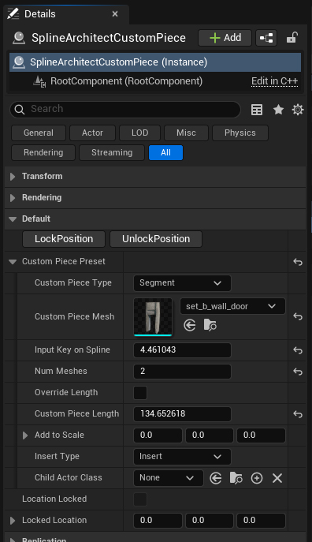

# SplineArchitectCustomPiece

## 1. What is `SplineArchitectCustomPiece`?

`SplineArchitectCustomPiece` is an actor that attaches to a `SplineArchitectWall` actor and allows you to insert any mesh between walls.

## 2. How to create a `SplineArchitectCustomPiece`?

There are two ways to create a `SplineArchitectCustomPiece` actor:

- The first way is to find it in the actor creation menu and drag it into the level. Then you need to attach it to a `SplineArchitectWall` actor, and it will snap to its parent `SplineArchitectWall` actor.

- The second way is to simply press the "Add Custom Piece" button in the Spline Architect utility widget. This button does the same as the instruction above. The new `SplineArchitectCustomPiece` will spawn at the viewport center in the level and attach to the selected `SplineArchitectWall` actor.

## 3. `SplineArchitectCustomPiece` parameters

{ width="250px" }

- **Lock Position** Locks the `CustomPiece` so its position remains fixed, even if the `SplineArchitectWall` is moved or changed. Useful when, for example, doors should always stay in the same spot in the level.
- **Unlock Position** Unlocks the `CustomPiece` position so it moves along with its `SplineArchitectWall` parent again.
- **Custom Piece Type** The `CustomPiece` can be either Segment or Corner type. Segment type Custom Pieces are inserted into the wall, like doors or windows. Corner type Custom Pieces can modify specific corner parameters, for example, to make a wall corner rounded.
- **Custom Piece Mesh** The mesh used as the Custom Piece.
- **Input Key on Spline** Indicates the position on the spline where the `CustomPiece` will be inserted. If the `CustomPiece` is moved manually, this parameter is found based on its position. You can also specify an exact spline key if you want to insert the `CustomPiece` perfectly centered between two spline points.
- **Floors** This parameter specifies on which floor the  `CustomPiece`  mesh and/or ChildActor will appear (if the `SplineArchitectWall` "Floors" parameter is greater than 1). You can specify a specific floor, multiple floors, or a range of floors where the `CustomPieces` will be added.  
- **Num Meshes** How many times the `CustomPiece` will be repeated. Useful if you want to repeat the `CustomPiece` multiple times within a segment. You can enter a very high number to fill the entire segment.
- **Override Length** If `true`, allows manual adjustment of the `CustomPiece` length; if `false`, the length is calculated automatically based on the `CustomPiece` mesh (length along the X axis).
- **Custom Piece Length** The length of the Custom Piece, either automatic or manual depending on the Override Length parameter.
- **Add to Scale** A vector added to the Custom Piece’s scale. Useful for manually increasing or decreasing the `CustomPiece` size.
- **Reverse Orientation** This parameter flips the orientation of the  `CustomPiece`  to the opposite direction.  
- **Insert Type** The way the `CustomPiece` is inserted. Can be `Insert` or `Overlap`. When `Insert`, the segment is cut out and replaced with the Custom Piece; when `Overlap`, the `CustomPiece` is simply placed over the existing segment.
- **Child Actor Class** The class used as a Child Actor. Useful if you want to add extra functionality to the Custom Piece, e.g., dynamically opening doors.
- **Location Locked** Indicates whether the `CustomPiece` position is locked or not.
- **Locked Location** The position used when Location Locked is `true`. When using Lock Position, this is set to the current `CustomPiece` position. Can be manually modified if needed.

## 4. Assign `CustomPiece` to specific floors

This feature allows `CustomPieces` to be assigned to specific floors of a `SplineArchitectWall`. It removes the need to create separate walls just to, for example, have a door `CustomPiece` only on the first floor.

The **Floors** parameter is a string located in the `CustomPiece` settings.  
It can specify:

- **a specific floor** (e.g. `1`)  
- **multiple floors** (e.g. `1,3,6`)  
- **a range** (e.g. `3-9`)  
- or a combination of these (e.g. `1,3,6-99`)  

