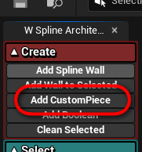
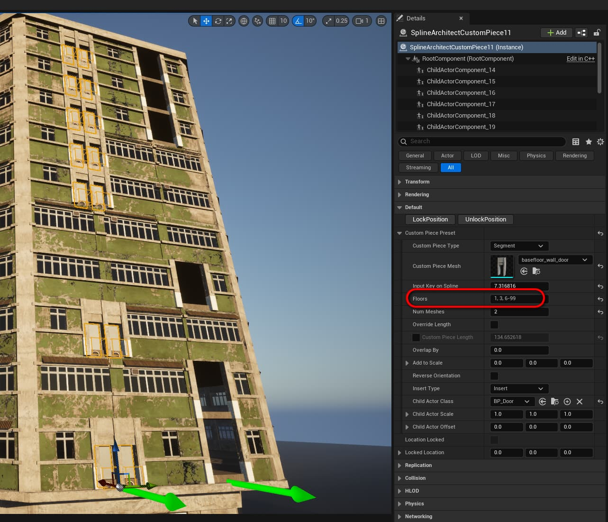

# SplineArchitectCustomPiece

## 1. Kas yra `SplineArchitectCustomPiece`?

`SplineArchitectCustomPiece` yra aktorius, kuris yra priattach'inamas prie `SplineArchitectWall` aktoriaus ir leidžia įterpti bet kokį mesh'ą tarp sienų

## 2. Kaip sukurti `SplineArchitectCustomPiece`?

`SplineArchitectCustomPiece` aktorius gali būti sukurtas dviem būdais:

- Pirmas būdas yra rasti aktorių kūrimo meniu ir nutempti jį į level'į. Tada reikia priattach'inti jį prie `SplineArchitectWall` aktoriaus, ir jis bus prisnap'inamas prie savo parent `SplineArchitectWall` aktoriaus

- Antras būdas yra tiesiog paspausti "Add Custom Piece" mygtuką Spline Architect pagalbiniame widget'e. Šis mygtukas padarys tą patį, kaip ir instrukcijos viršuje. Naujas `SplineArchitectCustomPiece` bus paspawn'intas levelyje viewport'o centre ir priattach'intas prie pažymėto `SplineArchitectWall` aktoriaus

## 3. `SplineArchitectCustomPiece` parametrai

{ width="250px" }

- __Lock Position__ Ši funkcija užrakins `CustomPiece` ir jos pozicija liks vietoje, net jei `SplineArchitectWall` bus perkeltas ar pakeistas. Tai naudinga, kai, sakykime durys turi būti visada vienoje vietoje level'yje
- __Unlock Position__ Ši funkcija atrakins `CustomPiece` poziciją, ir jis vėl judės kartu su savo `SplineArchitectWall` parent'u
- __Custom Piece Type__ `CustomPiece` gali būti Segment arba Corner tipo. Segment tipo `CustomPiece` bus įterptas į sieną, pavyzdžiui durys ar langas. Corner tipo `CustomPiece` gali pakeisti specifinio kampo parametrus, pavyzdžiui jeigu reikia vieną sienos kampą padarytį užapvalintą
- __Custom Piece Mesh__ Tai yra mesh'as, kuris bus naudojamas kaip Custom Piece
- __Input Key on Spline__ Šis parametras nurodo, kurioje vietoje Spline'e bus įterptas Custom Piece. Jeigu `CustomPiece` yra judinamas ranka, šis parametras bus rastas pagal `CustomPiece` poziciją. Taippat galima nurodytį specifinį Spline Key, jeigu, sakykime norime įterpti `CustomPiece` tobulai per centrą tarp dviejų Spline Point'ų- __Num Meshes__ Tai yra kiek kartų bus įterptas Custom Piece. Naudinga, jeigu norite, kad `CustomPiece` būtų kartojamas n kartų segmente. Galima įrašyti labai didelį skaičių, kad butų užpildytas visas segmentas.
- __Floors__ Šis parametras nurodo, kuriame aukšte atsiras  `CustomPiece`  mesh'as ir/ar ChildActor (jei `SplineArchitectWall` "Floors" parametras yra daugiau, nei 1). Galime nurodyti konkretų aukštą, kelis aukštus arba aukštų intervalą, kuriuose bus pridėti `CustomPieces`.
- __Override Length__ Jeigu Override Length yra `true`, galima koreguoti `CustomPiece` Length, jeigu ne, `CustomPiece` Length bus apskaičiuotas automatiškai pagal `CustomPiece` Mesh (ilgis X ašimi)
- __Custom Piece Length__ Tai yra `CustomPiece` ilgis, arba automatinis arba rankinis, priklausomai nuo Override Length parametro
- __Add to Scale__ Tai yra vektorius, kuris bus pridedamas prie `CustomPiece` scale'o. Naudinga, jeigu norite padidinti ar sumažinti `CustomPiece` dydį rankiniu būdu
- __Reverse Orientation__ Šis parametras apkeis `CustomPiece` orientaciją į kitą pusę
- __Insert Type__ Tai yra tipas, kaip bus įterptas Custom Piece. Gali būti `Insert`, arba `Overlap`. Kai `Insert`, segmentas bus iškirptas ir ten bus įklijuota Custom Piece, jeigu `Overlap`, `CustomPiece` bus tiesiog uždėtas ant esančio segmento
- __Child Actor Class__ Tai yra klasė, kuri bus naudojama kaip Child Actor. Naudinga, jeigu norite pridėti papildomų funkcijų prie Custom Piece, pavyzdžiui, dinamiškai atsidarinėjančias duris.
- __Location Locked__ Tai yra parametras, kuris rodo, ar `CustomPiece` pozicija yra užrakinta ar ne. 
- __Locked Location__ Tai yra `CustomPiece` pozicija, kuri bus naudojama, kai Location Locked yra `true`. Naudojant Lock Position funkciją, jis bus nustatytas į esamą `CustomPiece` poziciją. Galima modifikuoti rankiniu būdu, jeigu reikia.

## 4. Pritaikyti `CustomPiece` specifiniams aukštams

Ši funkcija leidžia `CustomPieces` priskirti konkretiems aukštams `SplineArchitectWall` objekte. Tai panaikina poreikį kurti atskiras sienas vien tik tam, kad, pavyzdžiui, pirmame aukšte turėtume durų `CustomPiece`.

**Floors** parametras yra tekstinė eilutė, esanti `CustomPiece` nustatymuose.  
Joje galima nurodyti:

  - **konkretų aukštą** (pvz. `1`)  
  - **kelis aukštus** (pvz. `1,3,6`)  
  - **intervalą** (pvz. `3-9`)  
  - arba šių kombinaciją (pvz. `1,3,6-99`)  

