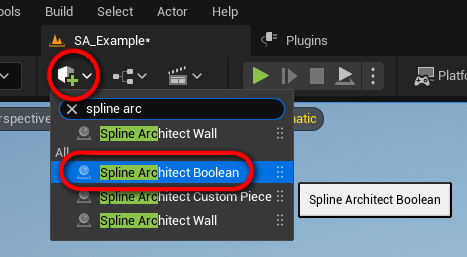
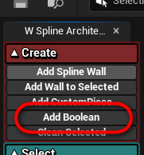

# SplineArchitectBoolean

## 1. What is `SplineArchitectBoolean`?

`SplineArchitectBoolean` is an actor that allows performing boolean operations on `SplineArchitectWall` floor or ceiling meshes. This lets you cut holes for stairs or similar features. The Boolean shape can be any StaticMesh asset.

---

## 2. How to create a `SplineArchitectBoolean`?

There are two ways to create a `SplineArchitectBoolean` actor:

- The first way is to find it in the actor creation menu and drag it into the level.

{ align=right }

- The second way is simply to press the "Add Boolean" button in the Spline Architect utility widget. This button does exactly the same as described above. The new `SplineArchitectBoolean` will spawn at the center of the viewport in the level. If it touches a `SplineArchitectWall`, it will automatically be added to the "Booleans to Use" array in that `SplineArchitectWall` actor.

---

## 3. How to use `SplineArchitectBoolean`?

| Description | Image |
|-------------|-------|
| A `SplineArchitectBoolean` actor can be used with one or multiple `SplineArchitectWall` actors. To cut a hole in a `SplineArchitectWall`, you must add the `SplineArchitectBoolean` to the "Booleans to Use" array in the `SplineArchitectWall` actor. | { width="150px" } |
| Booleans can be of any shape; the shape is copied from a `StaticMesh` asset. | { width="150px" } |
| When changing the mesh or position of a `SplineArchitectBoolean`, the associated `SplineArchitectWall` actors won’t update automatically and need to be regenerated. This can be done easily by selecting the `SplineArchitectWall` actor and pressing **"UnBake"** or **"Bake"** on the actor itself, or **"Unbake Connected"** or **"Rebake Connected"** in the utility widget. | { width="150px" } |
