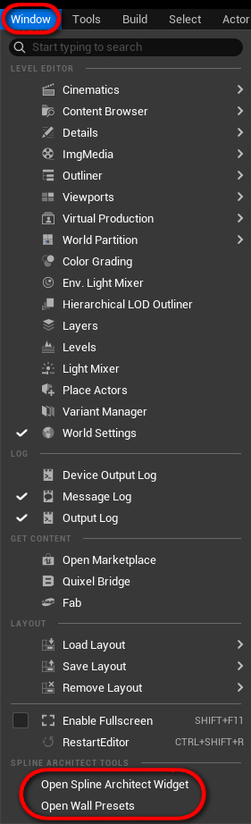

# Widget'ai

Spline Architect turi 2 widget'us, kurie sukurti tam, kad palengvinti ir pagreitinti darbą su pluginu.

- **W_SplineArchitectUtilityWidget'as** turi funkcijas greitai pridėti naujus aktorius, kaip `SplineArchitectWall`, `SplineArchitectBoolean` ar `SplineArchitectCustomPiece`, taip pat turi funkcijas greitai paselect'inti ar išbake'inti visus/pasirinktus/sujungtus `SplineArchitectWall` aktorius, taippat konvertuoti į paprastus aktorius. Taippat yra funkcijų darbui su Spline'ais
- **W_WallPresets widget'as** yra skirtas greitai sukurti naujus `SplineArchitectWall` preset'us, kurie gali būti arba pavienių `SplineArchitectWall` aktorių Preset'ai, arba Preset'ai, kurie sudaryti iš daugiau nei vieno `SplineArchitectWall` aktoriaus ir dar gali būtų su CustomPiece'ais. Pavyzdžiui pilni pastatai

Widget'ai gali būti atidaryt einant į **Window > Open Spline Architect Widget/Wall Presets**

{ width="150px" }

## Utility Widget'as

{ width="150px" }

### Create

| **Mygtukas**         | **Paaiškinimas**  |
|----------------------|---|
| Add Spline Wall      |Sukuria naują `SplineArchitectWall` Level’yje ir prideda prie jo `SplineComponent`.|
| Add Wall to Selected |Prideda naują `SplineArchitectWall` į Level’į ir automatiškai attach’ina ant šiuo metu pažymėto `SplineArchitectWall`'o (taip pat nukopijuoja `WallPreset` iš pažymėto `SplineArchitectWall`'o)|
| Add CustomPiece      |Spawn’ina `CustomPiece` ekrano centre ir attach’ina jį prie pažymėto `SplineArchitectWall`'o|
| Add Boolean          |Spawn’ina `SplineArchitectBoolean` ekrano centre. Jei yra pažymėtas `SplineArchitectWall`, Boolean’as automatiškai pridedamas į jo “Booleans to Use” array’ų|
| Clean Selected       |Palieka tik pagrindinį `SplineArchitectWall`'ą ir ištrina visus prie jo attach’intus actor’ius. Taip pat nustato švarų `WallPreset`|

---

### Select

| **Mygtukas**         | **Paaiškinimas**  |
|--------------------|---|
| Select Parents     |Pasirenkami tik parent `SplineArchitectWall`'ai su `SplineComponent` iš dabartinio selection’o|
| Select Connected   |Pasirenkami visi attach’inti `SplineArchitectWall`'ai, `CustomPiece`'ai ar kiti actor’iai — parent ir child|
| Walls ☑️ Pieces ☑️ Other ☑️           |Galima įtraukti arba atmesti `SplineArchitectWall`, `SplineArchitectCustomPiece` ar kitus actor’ius|

---

### Spline

| **Mygtukas**         | **Paaiškinimas**  |
|---------------------|---|
| StaticMesh dropdown 🔽         |Pasirenkamas `StaticMesh` (plokštuma su atvirais kraštais), kuris bus naudojamas kaip šablonas|
| Set points          |Paima border edge’us iš pažymėto mesh’o, esančio `Plugins/SplineArchitect/Meshes/BasicShapes` kataloge, ir pagal juos sugeneruoja spline point’us pažymėtiems `SplineArchitectWall`'ams|
| Refresh             |Paskenuoja `Plugins/SplineArchitect/Meshes/BasicShapes` folder’į ir atnaujina dropdown’o pasirinkimus|

---

### Bake

[Daugiau apie bake'inimą](../../Concepts/baking)

| **Mygtukas**         | **Paaiškinimas**  |
|----------------------|---|
| Unbake Connected     |At-bake’ina visus pažymėtus `SplineArchitectWall`'us (tėvinius ir vaikus)|
| ReBake Connected     |Iš naujo bake’ina visus pažymėtus `SplineArchitectWall`'us (tėvinius ir vaikus)|
| Unbake All           |At-bake’ina visus `SplineArchitectWall`'us Level’yje|
| ReBake All           |Bake’ina visus `SplineArchitectWall`'us Level’yje|
| Bake Unbaked         |Bake’ina tik tuos `SplineArchitectWall`'us, kurie dar nėra bake’inti|

---

### Convert

[Daugiau apie konvertavimą](../../Concepts/converting)

| **Mygtukas**         | **Paaiškinimas**  |
|----------------------|---|
| Actor per parent 🔽        |- **Actor per wall** – sukurs po vieną actor’į kiekvienam `SplineArchitectWall`, kuriame bus instancinti StaticMesh’ai. - **Actor per parent** – sukurs po actor’į kiekvienam `SplineArchitectWall`, paliekant tėvo/vaiko struktūrą. - **Actor per mesh** – sukurs po atskirą `StaticMeshActor` kiekvienam mesh’ui, naudinga kai norisi rankiniu būdu redaguoti.|
| Components 🔽              |- **Instanced** – sukurs tik `HierarchicalInstancedStaticMesh` komponentus. Naudoja mažiau draw call’ų, bet sunkiai redaguojama. - **Components** – sukurs `StaticMeshComponent` kiekvienam mesh’ui, lengviau redaguoti, bet reikalauja daugiau draw call’ų.|
| Convert Selected           |Konvertuoja pažymėtus `SplineArchitectWall`'us į paprastus actor’ius su komponentais. Naudinga kai projektas neturi `SplineArchitect` plugino|
| Convert All                |Konvertuoja visus `SplineArchitectWall`'us į paprastus actor’ius su komponentais|
| Delete original? ☑️        |Ištrina originalius `SplineArchitect` actor’ius ir palieka tik konvertuotus|

---

## Presets Widget'as

### Walls

- Tik sienų preset'ai. Leidžia greitai kopijuoti/įklijuoti atskirų SplineArchitectWall preset'us iš pažymėtų aktorių

| Mygtukas         | Aprašymas |
|------------------|-----------|
| **Copy**         |Nukopijuoja WallPreset struct'ą iš pažymėto SplineArchitectWall ir išsaugo jį kaip SaveGame failą SplineArchitectWallPresets.sav aplanke „YourProject\Saved\SaveGames“|

### Buildings

- Preset'ai, sudaryti iš kelių SplineArchitectWall ar CustomPiece. Leidžia greitai nukopijuoti/pakartoti visą pastato struktūrą

| Mygtukas         | Aprašymas |
|------------------|-----------|
| **Copy**         |Nukopijuoja SplineArchitectWall hierarchiją (ir, jei norima, CustomPiece) į preset'ą. Galima įklijuoti ant kito SplineArchitectWall, turinčio spline — taip atkartojant visą pastato stack'ą|
| **Paste**        |Įklijuoja anksčiau nukopijuotą hierarchiją ant pasirinkto SplineArchitectWall. Jei jis neturi SplineComponent, ieškos viršutinio tėvinio aktoriaus, kuris turi spline|
| **Copy Pieces?** |Ar kopijuoti ir CustomPiece aktorius, kurie prijungti prie pažymėto pastato|
| **PresetName**   |Preset'o pavadinimas|
| **Save Preset**  |Išsaugo preset'ą kaip SaveGame failą „SplineArchitectSaveGame.sav“, kuris atsiranda „YourProject\Saved\SaveGames“ aplanke|
| **Filter**       |Filtruoja preset'us pagal įvestą tekstą|
| **Clear Presets**|Ištrina visus preset'us!|
