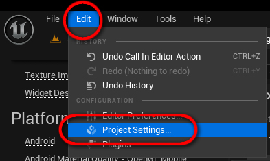
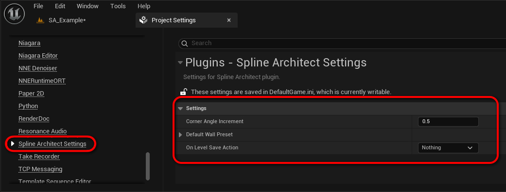

# Project Settings

Spline Architect turi keletą nustatymų Project Settings meniu.

Spline Architect nustatymai pasiekiami per Edit -> Project Settings -> Spline Architect. (Plugins kategorijoje)

 

## Corner Angle Increment
Kontroliuoja kas kiek laipsnių bus bake'inamas naujas mesh'as kampams. Kad išvengti per daug išbake'intų meshų, viskas bus apvalinama pagal šitą parametrą. Pvz, jeigu Corner Angle Increment yra 0.5, tai kampai bus išbake'inti kas 0.5 laipsnio (0.5, 1, 1.5 ir t.t.), o jeigu 1, tai kas 1 laipsnį (0, 1, 2 ir t.t.)

## Default Wall Preset
Čia yra nustatomas default `SplineArchitectWall` preset'as, kuris bus naudojamas kuriant naujus `SplineArchitectWall` aktorius.

## On Level Save Action
Šis nustatymas kontroliuoja, kas bus daroma su `SplineArchitectWall` aktoriais, kai yra išsaugomas Level'is. Tai yra naudinga, kad būtų galima automatiškai išbake'inti visus `SplineArchitectWall` aktorius prieš package'inant žaidimą.

Galima pasirinkti:

- `Nothing` - nieko nedaro, palieka viską taip kaip yra
- `Rebake Unbaked` - išbake'ina tik tuos `SplineArchitectWall` aktorius, kurie nėra išbake'inti
- `Rebake All` - išbake'ina visus `SplineArchitectWall` aktorius
- `Unbake All` - atbake'ina visus `SplineArchitectWall` aktorius

Pastaba: Aktoriai taip pat bus bake'inami vystant Auto-Save komandai.