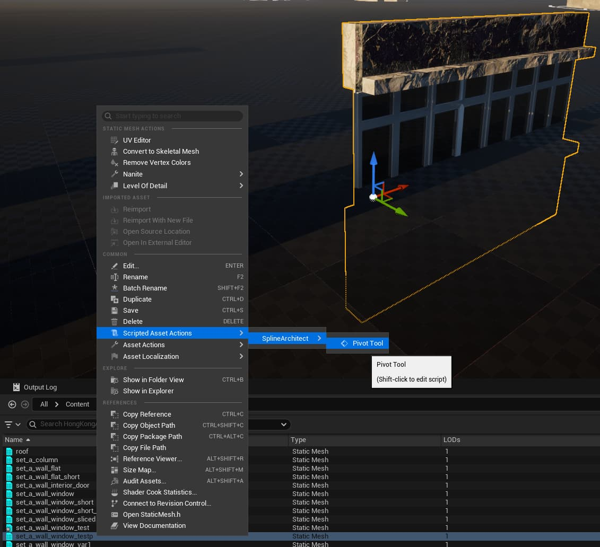
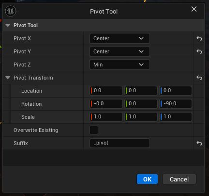
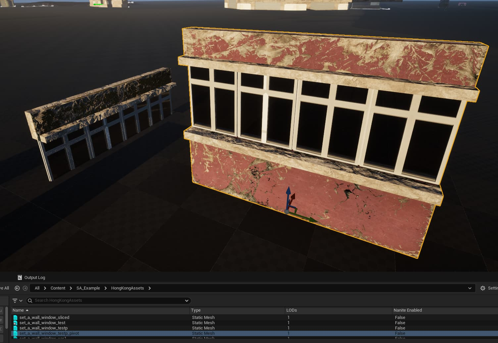

# Pivot Tool

A Blueprint Utility that allows changing the `StaticMesh` pivot. Many FAB Marketplace assets have different pivot locations.  
Spline Architect is designed to be used with pivots that are in the center of the mesh and on the floor, with mesh orientation along the X axis.  

With this tool it’s easy to adjust any `StaticMesh` pivot to make it compatible with Spline Architect, completely eliminating the need to export/reimport meshes. The tool preserves all LOD/Nanite settings and can either overwrite the existing asset or create a new one with the specified suffix.  

Let’s say we have a mesh with an incorrect pivot. We need to select this `StaticMesh` asset, right-click, and go to Scripted Actions > SplineArchitect > PivotTool.  

In this example, the `StaticMesh` pivot is somewhere in the middle of the Z axis, the mesh is oriented horizontally along the Y axis, and horizontally the pivot is on the edge of the mesh rather than the center. Such a mesh needs to be rotated 90 degrees, its pivot on the Z axis set to Min, and on the X axis the pivot must be in the center. Here’s how we should configure the PivotTool:  

After pressing “OK” we get the correct pivot and a newly generated `StaticMesh` asset with the ‘_pivot’ suffix.  

