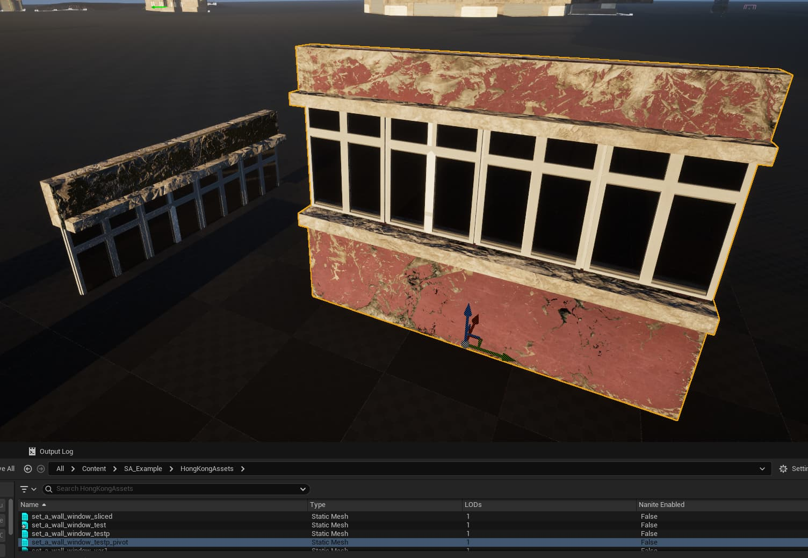

# Pivot Tool

Blueprint Utility, leidžiantis keisti `StaticMesh` pivot'ą. Daugelis FAB Marketplace asset’ų turi skirtingas pivot lokacijas. Spline Architect yra sukurtas naudoti su pivotais, kurie yra mesh’o centre bei ant grindų, o mesh’o orientacija eina pagal X ašį.  

Su šiuo įrankiu lengva pritaikyti bet kurio `StaticMesh` pivotą, kad jis būtų suderinamas su Spline Architect, visiškai atsisakant poreikio eksportuoti/reimportuoti mesh’us. Įrankis išsaugo visus LOD/Nanite nustatymus ir gali tiek perrašyti esamą, tiek sukurti naują asset’ą su nurodytu suffix'u.  

Tarkime, turime mesh’ą su neteisingu pivotu. Reikia pasirinkti šį `StaticMesh` asset’ą, paspausti dešinį pelės mygtuką ir eiti Scripted Actions > SplineArchitect > PivotTool.  

Šiame pavyzdyje `StaticMesh` pivot yra kažkur per vidurį Z ašyje, mesh’as pastatytas horizontaliai pagal Y ašį, o horizontaliai pivot yra ant krašto, o ne per vidurį. Tokį mesh’ą reikia pasukti 90 laipsnių, nustatyti pivot Z ašį į Min, o X ašyje pivot'as turi būti centre. Štai kaip turėtume sukonfigūruoti PivotTool:  

Paspaudus „OK“ gauname teisingą pivot'ą ir naujai sugeneruotą `StaticMesh` asset’ą su ‘_pivot’ suffix'u.  

