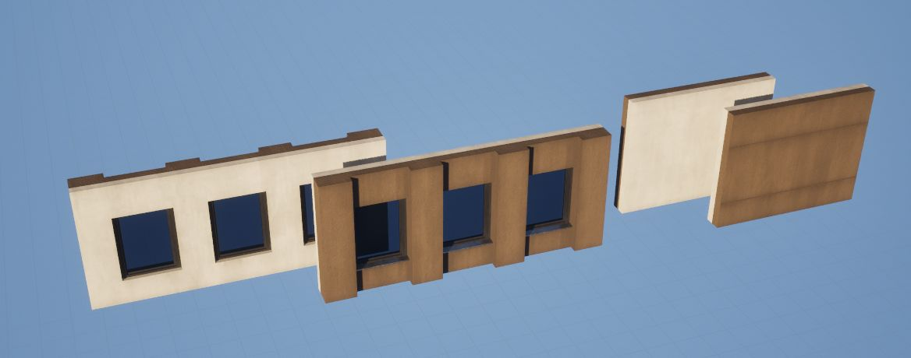
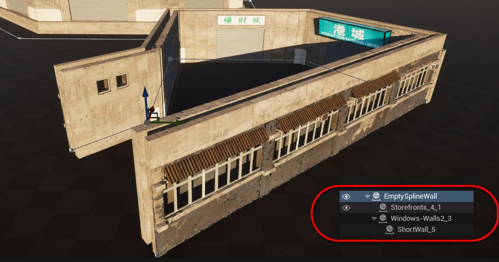

# Interior / Exterior Walls

Sometimes you may want different wall meshes for the **outside** and **inside** of a building (e.g. brick exterior, wood interior). There are a couple of ways to achieve this with Spline Architect, each with its pros and cons.

---

## Method A – Combined Mesh (Recommended for simplicity)

The easiest method is to combine both exterior and interior parts into **one mesh**:

1. Model or assemble a wall mesh that includes both the exterior and interior surfaces.  
2. Use *Actor > Convert to Static Mesh* in Unreal if needed.  
3. Use this mesh in Spline Architect as a normal wall.

**Pros:**
- Simple workflow.  
- Windows and doors only need one `CustomPiece` to cut through both sides.  
- Fewer walls to manage.  

**Cons:**
- Less flexible if you want to swap out materials or styles later.  

---

## Method B – Separate Stacked Walls (Flexible)

Another option is to use two `SplineArchitectWall` actors:  
- One for the **exterior**  
- One for the **interior**

You can keep them aligned by using an empty “control” Spline Wall with `WallHeight = 0`, and stack both walls on top of it.  
This way, you only modify **one spline**, and both walls follow it.

**Pros:**
- More flexible – you can use completely different meshes/materials for inside vs. outside.  
- Automatically adjusts to spline changes.  

**Cons:**
- `CustomPieces` (windows/doors) must be placed on both walls, which can be cumbersome.  
- Requires careful alignment of `Input Key on Spline` for matching CustomPieces.  
- Stacking logic may behave differently depending on your setup (e.g. empty walls vs. real walls).  