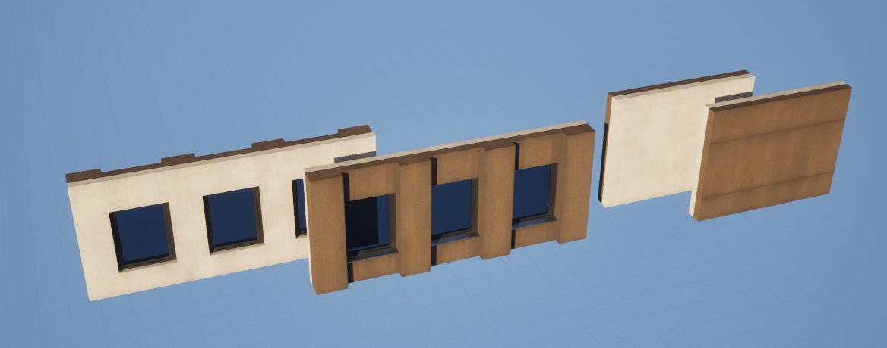

# Vidaus / Išorės sienos

Kartais gali prireikti naudoti skirtingus sienų mesh’us pastato **išorėje** ir **viduje** (pvz., plytų fasadas išorėje, medžio apdaila viduje). Tai galima pasiekti keliais būdais su Spline Architect, kiekvienas jų turi savų privalumų ir trūkumų.

---

## Metodas A – Kombinuotas mesh'as (paprasčiausias)

Lengviausias būdas – sujungti išorinę ir vidinę sienos dalį į **vieną mesh’ą**:

1. Sukurkite arba sukomponuokite sienos mesh’ą, kuriame būtų tiek išorinė, tiek vidinė dalis.  
2. Jei reikia, Unreal naudokite *Actor > Convert to Static Mesh*.  
3. Naudokite šį mesh’ą Spline Architect kaip paprastą sieną.  

**Privalumai:**  
- Paprastas darbo procesas.  
- Langams ir durims užtenka vieno `CustomPiece`, kuris išpjauna abiejose pusėse.  
- Mažiau sienų, kurias reikia prižiūrėti.  

**Trūkumai:**  
- Mažiau lankstus, jei vėliau norėsite pakeisti medžiagas ar stilių.  

---

## Metodas B – Atskiros sudėtos sienos (lankstesnis)

Kitas variantas – naudoti du `SplineArchitectWall` aktorius:  
- Vieną **išorei**  
- Kitą **vidui**  

Juos galima išlaikyti sulygiuotus naudojant tuščią „kontrolinę“ Spline sieną su `WallHeight = 0`, o virš jos uždėti abi sienas.  
Taip keičiate tik **vieną spline**, o abi sienos seka paskui jį.  

**Privalumai:**  
- Daugiau lankstumo – galima naudoti visiškai skirtingus mesh’us/medžiagas viduje ir išorėje.  
- Automatiškai prisitaiko prie spline pakeitimų.  

**Trūkumai:**  
- `CustomPieces` (langai/durys) turi būti dedami ant abiejų sienų, tai gali būti nepatogu.  
- Reikia tiksliai sulygiuoti `Input Key on Spline`, kad `CustomPieces` sutaptų.  
- Sienų „stackinimo“ logika gali skirtis, priklausomai nuo naudojamos konfigūracijos (pvz., tuščios sienos vs. realios sienos).  
