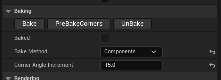
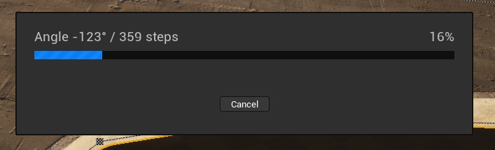
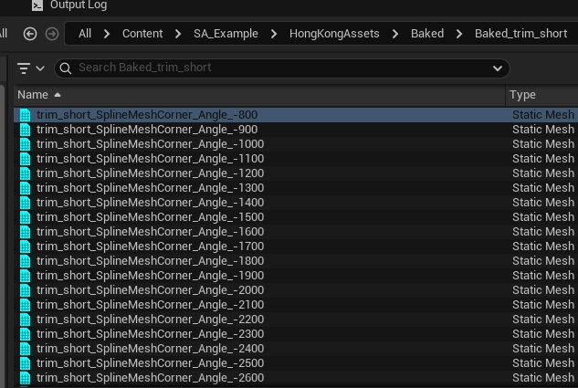
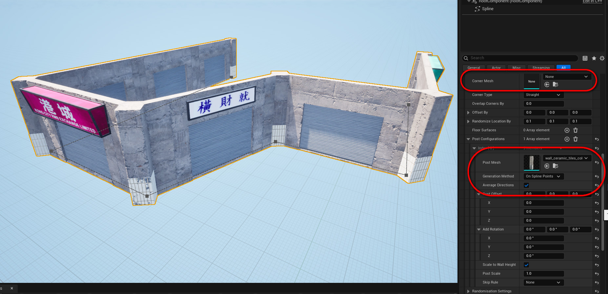
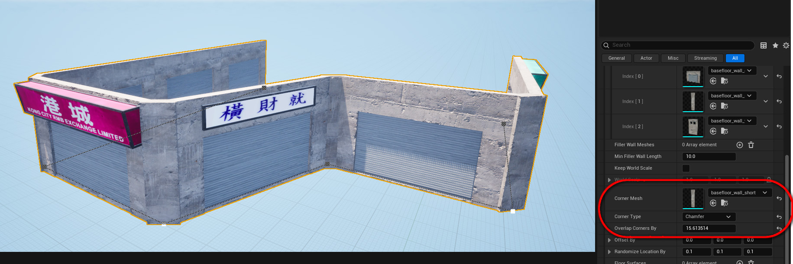

# Nanite

Working with Nanite can significantly slow down `SplineArchitectWall` generation, since such meshes contain a very large number of vertices.  

To speed up the generation process, here are a few tips:

## Pre-Bake Corners

You can pre-bake all possible corner variants, so that `SplineArchitectWall` can simply take an already generated mesh instead of creating it dynamically. This will greatly speed up the generation process.  

Also, to avoid having too many corner variations, you can increase the `Corner Angle Increment` value, so that corners are baked, for example, every 15 degrees.  

  
  
  

## Use posts instead of corners
You can skip corners entirely and just place *Posts* at `SplinePoints`. This will hide transitions between wall meshes. While it’s not exactly the same as using corners, the advantage is that no dynamic generation is required.  

  

## Use the “Chamfer” corner type
By choosing the “Chamfer” corner type, dynamic generation is not required either. This can be a good alternative if you want to completely avoid additional processing.  

