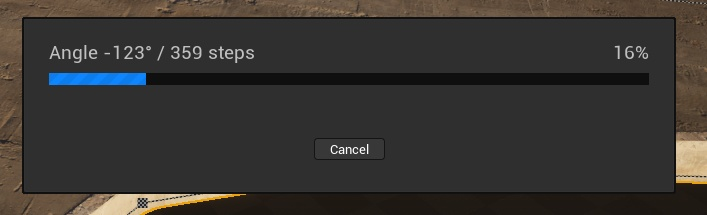
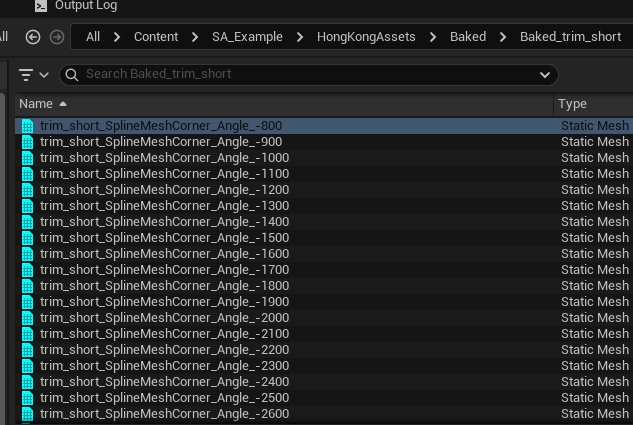
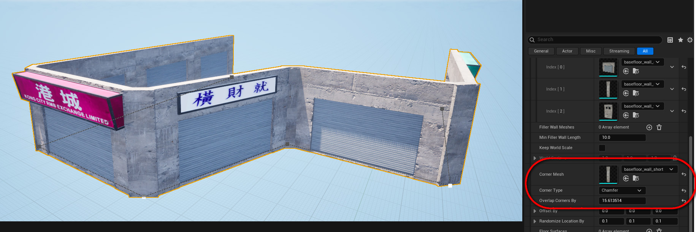

# Nanite

Darbas su Nanite gali reikšmingai prailginti SplineArchitectWall generaciją, kadangi tokie mesh'ai turi labai daug vertex'ų. 

Kad pagreitinti generacijos procesą, žemiau yra surašyti keli patarimai.

## Pre-Bake Corners 

Galima Pre-Bake'inti visus galimus kampų variantus, tada SplineArchitectWall galės tiesiog paimti jau sugeneruotą mesh'ą išvengiant dinaminės generacijos. Tai reikšimingai pagreitins generacijos procesą.

Taippat, tam kad išvengti labai daug skirtingų kampų variacijų, galima padidinti `Corner Angle Increment` reikšmę, kad kampai būtų bake'inami, pavyzdžiui, kas 15 laipsnių.

## Naudokite stulpus vietoje kampų
Galima visai nenaudoti kampų, o tiesiog pridėti *Posts* ties `SplinePoints`. Tai paslėps perėjimus tarp sienų mesh’ų. Tiesa, tai nėra visai tas pats, kas kampai, tačiau privalumas – visai nereikia dinaminės generacijos.
   

## Naudokite „Chamfer“ kampų tipą
Pasirinkus „Chamfer“ kampų tipą, dinaminės generacijos taip pat nereikia. Tai gali būti gera alternatyva, jei norite visiškai išvengti papildomo apkrovimo.

