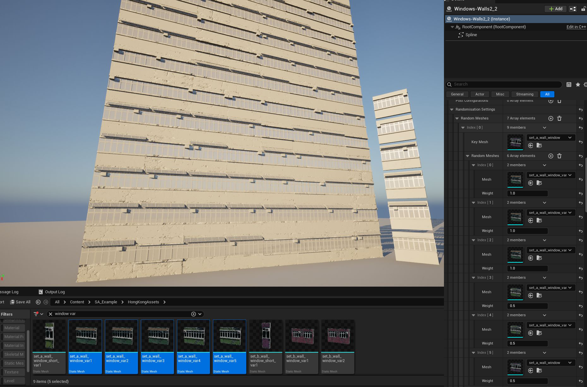
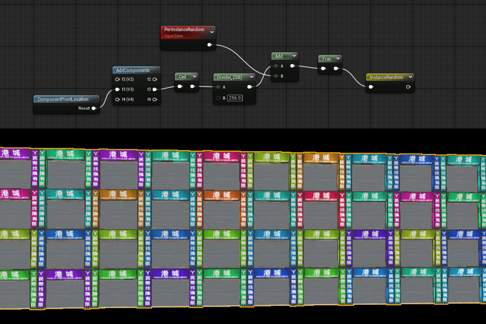
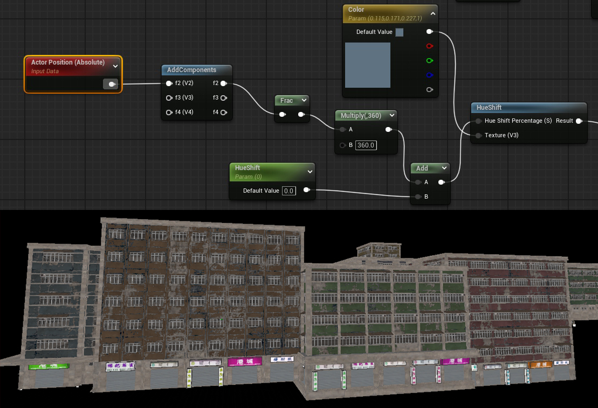

# Randomization

Laying out multiple same meshes can look repetetive. To break repetition you can use a couple of approaches: **mesh variation** and **material variation**.

- Use **mesh variation** to swap, mirror, rotate, or knock out meshes.  
- Use **material variation** to introduce random tiling, color shifts, and grunge effects.  

---

## 1. Randomization with Mesh Variations

Mesh randomization allows you to replace “key meshes” with random alternatives, mirror them, or rotate them to break repetition.

  

### FRandomMeshes Parameters

| Parameter | Description |
|-----------|-------------|
| **KeyMesh** – The mesh that will be replaced by one from the `RandomMeshes` array (including the KeyMesh itself). |
| **RandomMeshes** – An array of meshes with weights (`FRandomMeshWithWeight`). A higher weight increases the chance of being selected. |
| **FitRandomType** – `MatchScale` or `KeepScale` – whether the new mesh scales to fit the original or keeps its own scale. |
| **Knockout** – How many meshes are randomly removed (`0.0f = none`, `1.0f = all`). |
| **MirrorX / MirrorY / MirrorZ** – Randomly mirror the mesh on that axis. Only works when baking to `StaticMeshComponents`. |
| **Rot90** – Randomly rotate by 90, 180, or 270 degrees. |
| **Rot180** – Randomly rotate by 180 degrees. |

---

## 2. Randomization Inside Materials

Another way to break up repetition is to add variation **inside the material itself**, using world-space position or per-instance random values as a seed.

### Material Randomization Examples

You can use **per-component seeds** for small variations (e.g. random damage decals, grunge masks) and **per-actor seeds** for large-scale variation (e.g. different building colors).  

Examples from materials:

- **Per-Instance Random** or **Component Pivot Location** can be used to shift UVs, distort tiling, or randomize texture offsets.  
- **Actor Position** can be used as a seed to shift hue or other color variations per-building.  

*Randomizing storefront banner color with Per-Component seed.*

  

*Randomizing building color with Actor Position as a seed.*

  
