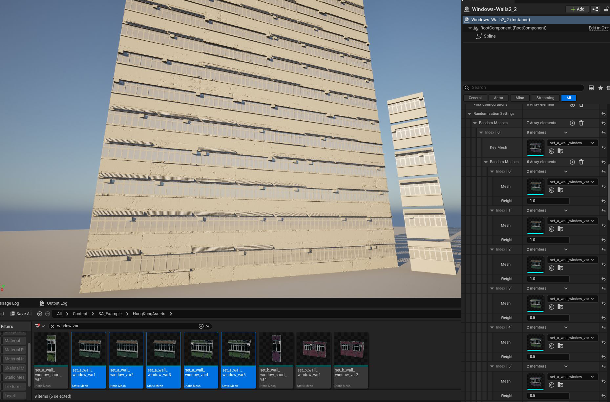
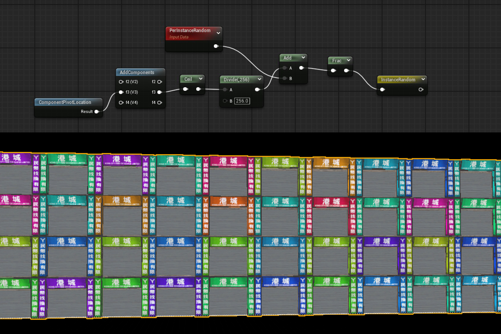

# Randomizacija

Naudojant daug tų pačių mesh’ų, vaizdas gali atrodyti pasikartojantis. Kad sulaužytumėte monotoniją, galima naudoti du metodus: **mesh variaciją** ir **material variaciją**.

- Naudokite **mesh variaciją**, kad sukeistumėte, apverstumėte, pasuktumėte arba pašalintumėte tam tikrus mesh’us.  
- Naudokite **material variaciją**, kad atsitiktinai keistumėte tilingą, spalvas ar pridėtumėte grunge efektus.  

---

## 1. Randomizacija su Mesh Variacijomis

Mesh randomizacija leidžia pakeisti „KeyMesh“ atsitiktiniais alternatyviais mesh’ais, apversti juos ar pasukti, kad būtų išvengta pasikartojimo.

  

### FRandomMeshes parametrai

| Parametras | Aprašymas |
|------------|-----------|
| **KeyMesh** – Mesh’as, kuris bus pakeistas vienu iš `RandomMeshes` masyvo (įskaitant ir patį KeyMesh). |
| **RandomMeshes** – Mesh’ų masyvas su svoriais (`FRandomMeshWithWeight`). Kuo didesnis svoris, tuo didesnė tikimybė, kad bus pasirinktas. |
| **FitRandomType** – `MatchScale` arba `KeepScale` – ar naujas mesh’as prisitaiko prie originalo skalės, ar išlaiko savo. |
| **Knockout** – Kiek mesh’ų bus atsitiktinai pašalinta (`0.0f = nieko`, `1.0f = visi`). |
| **MirrorX / MirrorY / MirrorZ** – Atsitiktinai apverčia mesh’ą pagal atitinkamą ašį. Veikia tik bake’inant į `StaticMeshComponents`. |
| **Rot90** – Atsitiktinai pasuka 90, 180 arba 270 laipsnių kampu. |
| **Rot180** – Atsitiktinai pasuka 180 laipsnių kampu. |

---

## 2. Randomizacija Material’uose

Kitas būdas išvengti pasikartojimo – įnešti variacijos **pačiame material’e**, naudojant world-space poziciją arba atsitiktines reikšmes kiekvienam instance kaip seed’ą.

### Material randomizacijos pavyzdžiai

Galima naudoti **per-component seed** mažoms variacijoms (pvz. atsitiktiniai damage decal’ai, grunge maskės) ir **per-actor seed** didelio masto variacijoms (pvz. skirtingos pastatų spalvos).  

Pavyzdžiai iš material’ų:

- **Per-Instance Random** arba **Component Pivot Location** galima naudoti UV poslinkiams, tilingo iškraipymui ar tekstūrų offset’ų randomizacijai.  
- **Actor Position** galima naudoti kaip seed’ą, kad keistų hue ar kitus spalvų variantus kiekvienam pastatui.  

*Atsitiktinė parduotuvės banerio spalva naudojant per-component seed.*

  

*Atsitiktinė pastato spalva naudojant Actor Position kaip seed’ą.*

  
