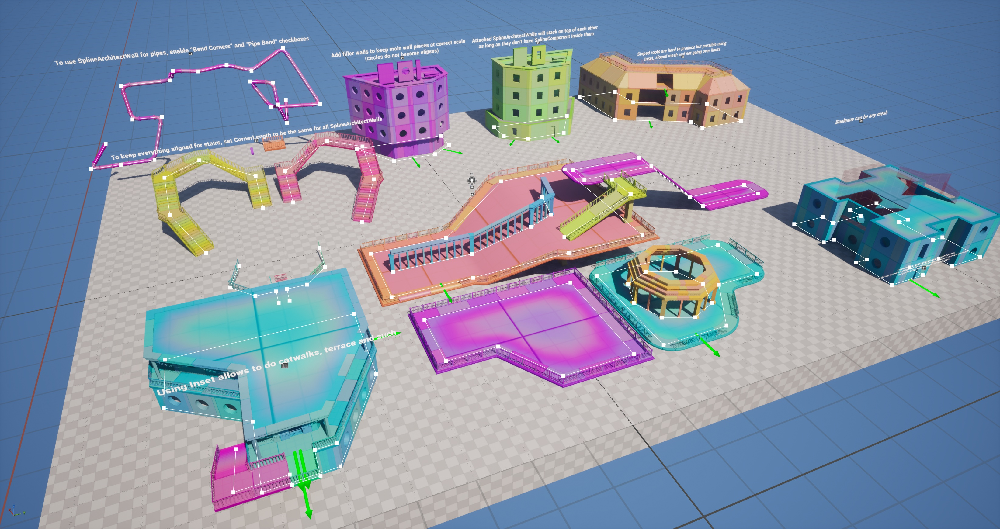

# Index
## Spline Architect – Procedural Walls, Buildings, and Structures with Splines

**Spline Architect** is a plugin for Unreal Engine 5 that enables fast, non-destructive creation of simple or complex structures and buildings using modular meshes placed along spline paths.

### Key Features

- Precise control using native UE5 Splines
- Modular meshes are laid out directly – no need to merge them into unique, non-reusable assets
- Auto-generated meshes (corners, floors) are intelligently named and reused whenever possible
- Preset system allows you to quickly save and reuse building/structure templates
- Structures can be baked either into `InstancedStaticMesh` components (for performance) or into individual `StaticMesh` components (for easy post-editing)
- Ability to convert generated structures into standard UE5 actors with components – making them fully portable to other projects without requiring the plugin

{ width="200px" }
{ width="200px" }
{ width="200px" }
{ width="200px" }
{ width="200px" }
